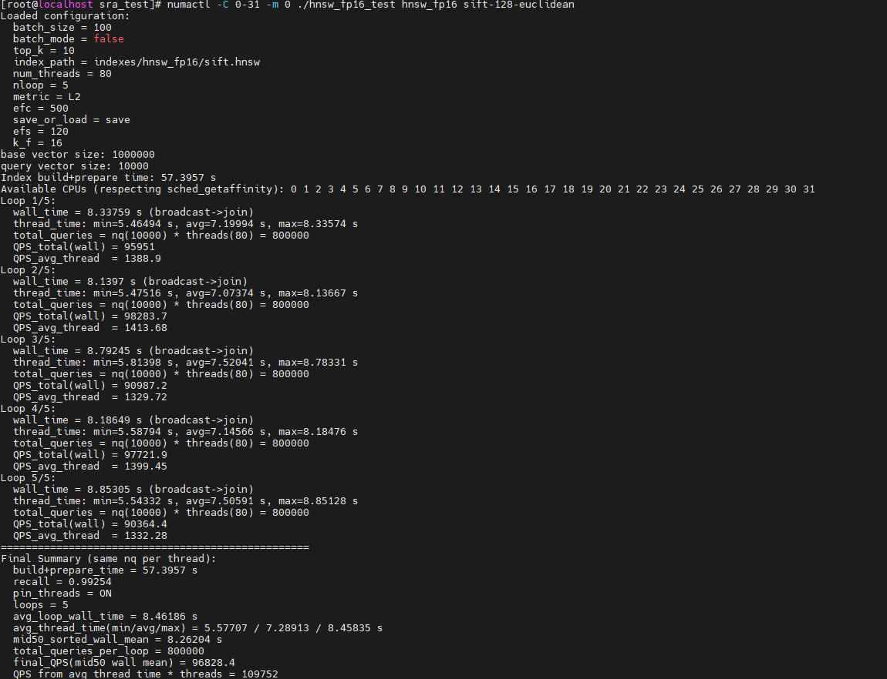

# Best Practices

## Non-Equivalence Optimization

This section describes how to test Faiss after non-equivalence optimization on the Kunpeng platform. The test depends on the Kunpeng non-equivalence optimization patch file `0001-faiss_1.8.0-optimize-neq.patch`. The example uses the `sift-128-euclidean.hdf5` dataset, Faiss-supported algorithm (IVFPQ), and 32 threads.

**Obtaining the Dataset and Test Program <a name="section5124167418"></a>**

1. Obtain the [test program](https://atomgit.com/openeuler/sra_test.git). The branch is `v2.0.0`. Assume that the program runs at the `/path/to/sra_test` directory. The full directory structure is as follows:

    ```text
    ├── configs                                                   // Stores configuration files for the algorithm and dataset.
          └── ivfpq
                └── ivfpq_sift-128-euclidean.config 
    ├── include                                                   // Stores header files of the test framework.
          └── algo                                                // Algorithm index definitions
          └── core                                                // Header files for data processing and test result processing
          └── framework                                           // Header files related to the test framework
    ├── src                                                       // Stores source files of the test framework.
          └── algo                                                // Algorithm adaptation layers
          └── bench                                               // Centralized test file
          └── core                                                // Files for data processing and test result processing
          └── registry                                            // Algorithm factory registry
    ├── Makefile                                                  // Script for compiling the program
    └── test.sh                                                 // Script for running the test
    ├── test_muti-numas.sh                                        // Script for running the parallel test
    ├── data                                                      // Directory for storing datasets (You need to manually create and store datasets.)
          └── sift-128-euclidean.hdf5
    ├── indexes
          └── ivfpq                                               // Stores manually built index.
                └── sift.faiss                                    // Built index, which is generated when the executable file ivfpq_test runs and the save_or_load parameter in the dataset configuration file is set to save.
    └── ivfpq_test                                                // Executable file generated after compilation.
    ```

2. <a name="li1673311431218"></a>Obtain the dataset and save it to <code>/path/to/sra_test/data</code>.

    ```bash
    cd /path/to/sra_test/data
    wget http://ann-benchmarks.com/sift-128-euclidean.hdf5 --no-check-certificate
    ```

**Faiss Test After Non-Equivalence Optimization<a name="section41250624115"></a>**

1. Install the dependencies.

    ```bash
    yum install hdf5 hdf5-devel numactl numactl-devel
    ```

2. Compile and install Faiss as described in [Installation Guide](./installation_guide.md).
   >**Note:** For the Faiss test after non-equivalence optimization, enable the macros related to Kunpeng optimization. The following uses `-DOPTI_IVFPQ=ON` for illustration.
3. Build the executable file. Enter the Faiss installation path and the paths to other required dependencies as prompted by the command line. Note: Set `-DOPTI_IVFPQ` to `ON` as prompted. If `-DKRL` is set to `ON` in step [2](#li1673311431218), enable it here as well.

    ```bash
    make ivfpq_test
    ```

    > **NOTE:**
    >During the test, select the appropriate compilation instruction for each algorithm.
    >- HNSW: `make hnsw_test`
    >- HNSW (FP16): make hnsw_fp16_test
    >- PQFS: `make pqfs_test`
    >- IVFPQ: `make ivfpq_test`
    >- IVFPQFS: `make ivfpqfs_test`
    >- IVFFLAT: `make ivfflat_test`

4. For the first run, ensure that `save_or_load` in the `ivfpq_sift-128-euclidean.config` file is set to `save`. In subsequent runs, you can change it to `load` to use the built graph index or retriever for querying.
5. Run the executable file. Add the OpenBLAS and Faiss dynamic library paths to the environment variable.

    ```bash
    numactl -C 0-31 -m 0 ./ivfpq_test ivfpq sift-128-euclidean
    ```

The test result is as follows:


## Equivalence Optimization

This section describes how to test Faiss after equivalence optimization on the Kunpeng platform. The test depends on the Kunpeng equivalence optimization patch file `0002-faiss_1.8.0-optimize-eqv.patch`. The example uses the `sift-128-euclidean.hdf5` dataset, Faiss-supported algorithm (IVFPQ), and 32 threads.

**Obtaining the Dataset and Test Program <a name="section5124167418"></a>**

1. Obtain the [test program](https://atomgit.com/openeuler/sra_test.git). The branch is `v2.0.0`. Assume that the program runs at the `/path/to/sra_test` directory. The full directory structure is as follows:

    ```text
    ├── configs                                                   // Stores configuration files for the algorithm and dataset.
          └── ivfpq
                └── ivfpq_sift-128-euclidean.config 
    ├── include                                                   // Stores header files of the test framework.
          └── algo                                                // Algorithm index definitions
          └── core                                                // Header files for data processing and test result processing
          └── framework                                           // Header files related to the test framework
    ├── src                                                       // Stores source files of the test framework.
          └── algo                                                // Algorithm adaptation layers
          └── bench                                               // Centralized test file
          └── core                                                // Files for data processing and test result processing
          └── registry                                            // Algorithm factory registry
    ├── Makefile                                                  // Script for compiling the program
    └── test.sh                                                 // Script for running the test
    ├── test_muti-numas.sh                                        // Script for running the parallel test
    ├── data                                                      // Directory for storing datasets (You need to manually create and store datasets.)
          └── sift-128-euclidean.hdf5
    ├── indexes
          └── ivfpq                                               // Stores manually built index.
                └── sift.faiss                                    // Built index, which is generated when the executable file ivfpq_test runs and the save_or_load parameter in the dataset configuration file is set to save.
    └── ivfpq_test                                                // Executable file generated after compilation.
    ```

2. Obtain the dataset and save it to `/path/to/sra_test/data`.

    ```bash
    cd /path/to/sra_test/data
    wget http://ann-benchmarks.com/sift-128-euclidean.hdf5 --no-check-certificate
    ```

**Faiss Test After Equivalence Optimization<a name="section41250624115"></a>**

1. Install the dependencies.

    ```bash
    yum install hdf5 hdf5-devel numactl numactl-devel
    ```

2. Compile and install Faiss as described in [Faiss Installation Guide](./installation_guide.md).
   > **Note:** For the Faiss test after equivalence optimization, enable the macro related to Kunpeng optimization: `-DKRL=ON`.
3. Build the executable file. Enter the Faiss installation path and the paths to other required dependencies as prompted by the command line. Note: Set `-DKRL` to `ON` as prompted.

    ```bash
    make ivfpq_test
    ```

    > **NOTE:**
    >During the test, select the appropriate compilation instruction for each algorithm.
    >- HNSW: `make hnsw_test`
    >- HNSW (FP16): make hnsw_fp16_test
    >- PQFS: `make pqfs_test`
    >- IVFPQ: `make ivfpq_test`
    >- IVFPQFS: `make ivfpqfs_test`
    >- IVFFLAT: `make ivfflat_test`

4. For the first run, ensure that `save_or_load` in the `ivfpq_sift-128-euclidean.config` file is set to `save`. In subsequent runs, you can change it to `load` to use the built graph index or retriever for querying.
5. Run the executable file. Add the OpenBLAS and Faiss dynamic library paths to the environment variable.

    ```bash
    numactl -C 0-31 -m 0 ./ivfpq_test ivfpq sift-128-euclidean
    ```

The test result is as follows:


## HNSW FP16 Support

This section describes how to test Faiss with HNSW FP16 interface support on the Kunpeng platform. The test depends on the Kunpeng optimization patch file `0001-faiss\_1.8.0-optimize-neq.patch` or `0002-faiss\_1.8.0-optimize-eqv.patch`. The example uses the `sift-128-euclidean.hdf5` dataset, Faiss-supported algorithm (HNSW), and 32 threads.

**Obtaining the Dataset and Test Program <a name="section5124167418"></a>**

1. Obtain the [test program](https://atomgit.com/openeuler/sra_test.git). The branch is `v2.0.0`. Assume that the program runs at the `/path/to/sra_test` directory. The full directory structure is as follows:

    ```text
    ├── configs                                                   // Stores configuration files for the algorithm and dataset.
          └── hnsw
                └── hnsw_sift-128-euclidean.config 
    ├── include                                                   // Stores header files of the test framework.
          └── algo                                                // Algorithm index definitions
          └── core                                                // Header files for data processing and test result processing
          └── framework                                           // Header files related to the test framework
    ├── src                                                       // Stores source files of the test framework.
          └── algo                                                // Algorithm adaptation layers
          └── bench                                               // Centralized test file
          └── core                                                // Files for data processing and test result processing
          └── registry                                            // Algorithm factory registry
    ├── Makefile                                                  // Script for compiling the program
    └── test.sh                                                 // Script for running the test
    ├── test_muti-numas.sh                                        // Script for running the parallel test
    ├── data                                                      // Directory for storing datasets (You need to manually create and store datasets.)
          └── sift-128-euclidean.hdf5
    ├── indexes
          └── hnsw-fp16                                           // Stores the built index (manually created).
                └── sift.faiss                                    // Built index, which is generated when the executable file hnsw_test runs and the save_or_load parameter in the dataset configuration file is set to save.
    └── hnsw_fp16_test                                            // Executable file generated after compilation.
    ```

2. Obtain the dataset and save it to `/path/to/sra_test/data`.

    ```bash
    cd /path/to/sra_test/data
    wget http://ann-benchmarks.com/sift-128-euclidean.hdf5 --no-check-certificate
    ```

**HNSW FP16 Interface Support Test<a name="section41250624115"></a>**

1. Install the dependencies.

    ```bash
    yum install hdf5 hdf5-devel numactl numactl-devel
    ```

2. Compile and install Faiss as described in [Installation Guide](./installation_guide.md).
3. Build the executable file. Enter the Faiss installation path and the paths to other required dependencies as prompted by the command line. Note: set `-DKRL` to `ON` and set `-DUSE_FP16` to ON as prompted.

    ```bash
    make hnsw_fp16_test
    ```

    > **NOTE:**
    >During the test, select the appropriate compilation instruction for each algorithm.
    >- HNSW: `make hnsw_test`
    >- HNSW (FP16): make hnsw_fp16_test
    >- PQFS: `make pqfs_test`
    >- IVFPQ: `make ivfpq_test`
    >- IVFPQFS: `make ivfpqfs_test`
    >- IVFFLAT: `make ivfflat_test`

4. For the first run, ensure that `save_or_load` in the `hnsw_sift-128-euclidean.config` file is set to `save`. In subsequent runs, you can change it to `load` to use the built graph index or retriever for querying.
5. Run the executable file. Add the OpenBLAS and Faiss dynamic library paths to the environment variable.

    ```bash
    numactl -C 0-31 -m 0 ./hnsw_fp16_test hnsw_fp16 sift-128-euclidean
    ```

The test result is as follows:


