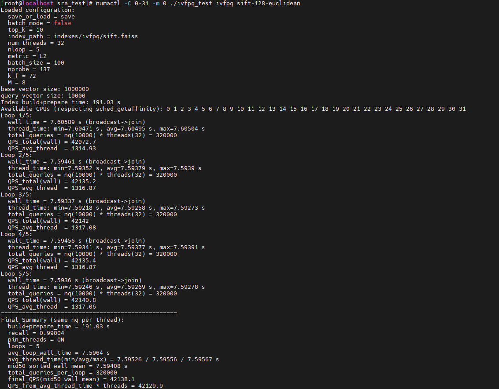
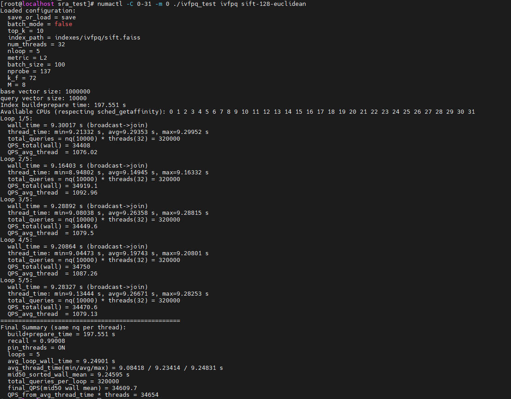
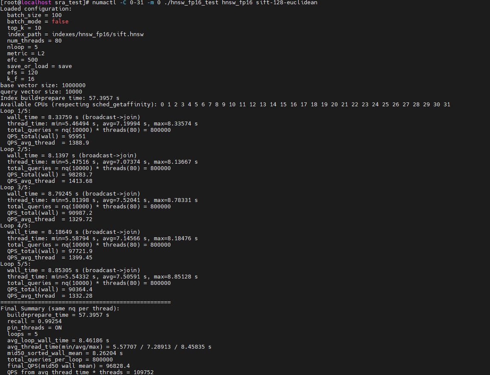
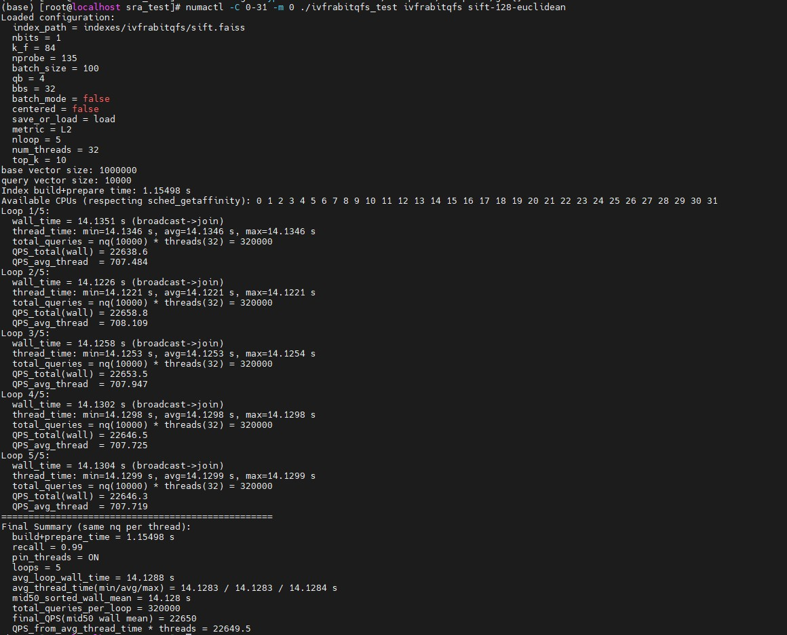

# Best Practices

<!-- md-trans-meta sourceCommit=f37b02b5e16979c51738f39f4644194f3b94deff translatedAt=2026-08-06T08:58:23.447Z pushedAt=2026-08-07T01:07:09.481Z -->

## v1.8.0

### Non-Equivalence Optimization

This section describes how to test Faiss after full optimization based on Faiss v1.8.0 on the Kunpeng platform. The test depends on the Kunpeng full optimization patch file `0001-faiss_1.8.0-optimize-neq.patch`. The example uses the `sift-128-euclidean.hdf5` dataset, the Faiss (IVFPQ) algorithm, and a thread count of 32.

**Obtaining the Dataset and Test Program <a name="section5124167418"></a>**

1. Obtain the [test program](https://atomgit.com/openeuler/sra_test.git). The branch is `v2.1.0`. Assume that the program runs at the `/path/to/sra_test` directory. The full directory structure is as follows:

    ```text
    ├── configs                                                   // Stores configuration files for the corresponding algorithms and datasets.
          └── ivfpq
                └── ivfpq_sift-128-euclidean.config 
    ├── include                                                   // Stores header files for the test framework.
          └── algo                                                // Definitions of each algorithm Index
          └── core                                                // Header files for data processing, test result processing, etc.
          └── framework                                           // Header files related to the test framework
    ├── src                                                       // Stores source files corresponding to the test framework
          └── algo                                                // Adaptation layer for each algorithm
          └── bench                                               // Unified test files
          └── core                                                // Data processing, test result processing, and other files
          └── registry                                            // Algorithm factory registration
    ├── Makefile                                                  // Compilation script file
    ├── test.sh                                                   // Test script
    ├── test_muti-numas.sh                                        // Parallel test script
    ├── data                                                      // Stores datasets (manually create and place datasets here)
          └── sift-128-euclidean.hdf5
    ├── indexes
          └── ivfpq                                               // Stores built indexes (manually create)
                └── sift.faiss                                    // Built index, generated when the executable file ivfpq_test is run and the save_or_load parameter in the dataset configuration file is set to save
    └── ivfpq_test                                                // Executable file generated after compilation
    ```

2. <a name="li1673311431218"></a>Obtain the dataset and save it to <code>/path/to/sra\_test/data</code>.

    ```bash
    cd /path/to/sra_test/data
    wget http://ann-benchmarks.com/sift-128-euclidean.hdf5 --no-check-certificate
    ```

**Faiss Test After Non-Equivalence Optimization<a name="section41250624115"></a>**

1. Install the dependencies.

    ```bash
    yum install hdf5 hdf5-devel numactl numactl-devel
    ```

2. Compile and install Faiss as described in [*Installation Guide*](./installation_guide.md).<a id="li1673311431218"></a>

   >**Note:** For the Faiss test after non-equivalence optimization, enable the macros related to Kunpeng optimization. The following uses `-DOPTI_IVFPQ=ON` for illustration.

3. Build the executable file. Enter the Faiss installation path and the paths to other required dependencies as prompted by the command line. Note: Set `-DOPTI_IVFPQ` to `ON` as prompted. If `-DKRL` is set to `ON` in step [2](#li1673311431218), enable it here as well.

    ```bash
    make ivfpq_test
    ```

    > **NOTE:**
    >During the test, select the appropriate compilation instruction for each algorithm.
    >- HNSW: `make hnsw_test`
    >- HNSW (FP16): `make hnsw_fp16_test`
    >- PQFS: `make pqfs_test`
    >- IVFPQ: `make ivfpq_test`
    >- IVFPQFS: `make ivfpqfs_test`
    >- IVFFLAT: `make ivfflat_test`

4. For the first run, ensure that `save_or_load` in the `ivfpq_sift-128-euclidean.config` file is set to `save`. In subsequent runs, you can change it to `load` to use the built graph index or retriever for querying.

5. Run the executable file. Add the OpenBLAS and Faiss dynamic library paths to the environment variable.

    ```bash
    numactl -C 0-31 -m 0 ./ivfpq_test ivfpq sift-128-euclidean
    ```

The test result is as follows:



### Equivalence Optimization

This section describes how to test Faiss after equivalence optimization on the Kunpeng platform. The test depends on the Kunpeng equivalence optimization patch file `0002-faiss_1.8.0-optimize-eqv.patch`. The example uses the `sift-128-euclidean.hdf5` dataset, Faiss-supported algorithm (IVFPQ), and 32 threads.

**Obtaining the Dataset and Test Program <a name="section5124167418"></a>**

1. Obtain the [test program](https://atomgit.com/openeuler/sra_test.git). The branch is `v2.1.0`. Assume that the program runs at the `/path/to/sra_test` directory. The full directory structure is as follows:

    ```text
    ├── configs                                                   // Stores configuration files for corresponding algorithms and datasets.
          └── ivfpq
                └── ivfpq_sift-128-euclidean.config 
    ├── include                                                   // Stores header files for the test framework.
          └── algo                                                // Index implementations for each algorithm.
          定义
          └── core                                                // Header files for data processing, test result processing, etc.
          └── framework                                           // Header files related to the test framework.
    ├── src                                                       // Stores source files for the test framework
          └── algo                                                // Algorithm adaptation layers
          └── bench                                               // Unified test files
          └── core                                                // Data processing, test result processing, and other files
          └── registry                                            // Algorithm factory registration
    ├── Makefile                                                  // Compilation script file.
    ├── test.sh                                                   // Test script.
    ├── test_muti-numas.sh                                        // Parallel test script.
    ├── data                                                      // Stores datasets (needs to be manually created and datasets placed here).
          └── sift-128-euclidean.hdf5
    ├── indexes
          └── ivfpq                                               // Stores built indexes (needs to be manually created).
                └── sift.faiss                                    // The built index, generated when the executable file ivfpq_test is run and the save_or_load parameter in the dataset configuration file is set to save
    └── ivfpq_test                                                // The executable file generated after compilation
    ```

2. Obtain the dataset and save it to `/path/to/sra_test/data`.

    ```bash
    cd /path/to/sra_test/data
    wget http://ann-benchmarks.com/sift-128-euclidean.hdf5 --no-check-certificate
    ```

**Faiss Test After Equivalence Optimization<a name="section41250624115"></a>**

1. Install the dependencies.

    ```bash
    yum install hdf5 hdf5-devel numactl numactl-devel
    ```

2. Install Faiss by referring to the [Installation Guide](./installation_guide.md).

   > **Note:** For the Faiss test after equivalence optimization, enable the macro related to Kunpeng optimization: `-DKRL=ON`.

3. Build the executable file. Enter the Faiss installation path and the paths to other required dependencies as prompted by the command line. Note: Set `-DKRL` to `ON` as prompted.

    ```bash
    make ivfpq_test
    ```

    > **NOTE:**
    >During the test, select the appropriate compilation instruction for each algorithm.
    >- HNSW: `make hnsw_test`
    >- HNSW (FP16): `make hnsw_fp16_test`
    >- PQFS: `make pqfs_test`
    >- IVFPQ: `make ivfpq_test`
    >- IVFPQFS: `make ivfpqfs_test`
    >- IVFFLAT: `make ivfflat_test`

4. For the first run, ensure that `save\_or\_load` in the `ivfpq\_sift-128-euclidean.config` file is set to `save`. In subsequent runs, you can change it to `load` to use the built graph index or retriever for querying.

5. Run the executable file. Add the OpenBLAS and Faiss dynamic library paths to the environment variable.

    ```bash
    numactl -C 0-31 -m 0 ./ivfpq_test ivfpq sift-128-euclidean
    ```

The test result is as follows:



### HNSW FP16 Support

This section describes how to test Faiss with HNSW FP16 interface support based on Faiss v1.8.0 on the Kunpeng platform. The test depends on the Kunpeng optimization patch file `0001-faiss\_1.8.0-optimize-neq.patch` or `0002-faiss\_1.8.0-optimize-eqv.patch`. The example uses the `sift-128-euclidean.hdf5` dataset, Faiss-supported algorithm (HNSW), and 32 threads.

**Obtaining the Dataset and Test Program <a name="section5124167418"></a>**

1. Obtain the [test program](https://atomgit.com/openeuler/sra_test.git). The branch is `v2.1.0`. Assume that the program runs at the `/path/to/sra\_test` directory. The full directory structure is as follows:

    ```text
    ├── configs                                                   // Store configuration files for the corresponding algorithms and datasets.
          └── hnsw
                └── hnsw_sift-128-euclidean.config 
    ├── include                                                   // Store header files for the test framework.
          └── algo                                                // Index definitions for each algorithm.
          └── core                                                // Header files for data processing, test result processing, etc.
          └── framework                                           // Header files related to the test framework.
    ├── src                                                       // Stores source files corresponding to the test framework.
          └── algo                                                // Adaptation layer for each algorithm.
          └── bench                                               // Unified test files.
          └── core                                                // Files for data processing, test result processing, etc.
          └── registry                                            // Registration of algorithm factories
    ├── Makefile                                                  // Compilation script file
    ├── test.sh                                                   // Test script
    ├── test_muti-numas.sh                                        // Parallel test script
    ├── data                                                      // Stores datasets (must be manually created and populated with datasets).
          └── sift-128-euclidean.hdf5
    ├── indexes
          └── hnsw-fp16                                           // Stores built indexes (must be manually created).
                └── sift.faiss                                    // A built index, generated when the executable file hnsw_test is run and the save_or_load parameter in the dataset configuration file is set to save.
    └── hnsw_fp16_test                                            // The executable file generated after compilation.
    ```

2. Obtain the dataset and save it to `/path/to/sra_test/data`.

    ```bash
    cd /path/to/sra_test/data
    wget http://ann-benchmarks.com/sift-128-euclidean.hdf5 --no-check-certificate
    ```

**HNSW FP16 Interface Support Test<a name="section41250624115"></a>**

1. Install the dependencies.

    ```bash
    yum install hdf5 hdf5-devel numactl numactl-devel
    ```

2. Compile and install Faiss as described in [<i>Installation Guide</i>](./installation_guide.md).

3. Build the executable file. Enter the Faiss installation path and the paths to other required dependencies as prompted by the command line. Note: set `-DKRL` to `ON` and set `-DUSE_FP16` to `ON` as prompted.

    ```bash
    make hnsw_fp16_test
    ```

    > **NOTE:**
    >During the test, select the appropriate compilation instruction for each algorithm.
    >- HNSW: `make hnsw_test`
    >- HNSW (FP16): `make hnsw_fp16_test`
    >- PQFS: `make pqfs_test`
    >- IVFPQ: `make ivfpq_test`
    >- IVFPQFS: `make ivfpqfs_test`
    >- IVFFLAT: `make ivfflat_test`

4. For the first run, ensure that `save_or_load` in the `hnsw_sift-128-euclidean.config` file is set to `save`. In subsequent runs, you can change it to `load` to use the built graph index or retriever for querying.

5. Run the executable file. Add the OpenBLAS and Faiss dynamic library paths to the environment variable.

    ```bash
    numactl -C 0-31 -m 0 ./hnsw_fp16_test hnsw_fp16 sift-128-euclidean
    ```

The test result is as follows:



## v1.14.3

This section describes how to test Faiss optimized based on Faiss v1.14.3 on the Kunpeng platform, which depends on the Kunpeng RabitQ index optimization patch file 0001-faiss_1.14.3-optimize-rabitq.patch. The example uses the sift-128-euclidean.hdf5 dataset, the Faiss (IVFRabitQFS) algorithm, and a thread count of 32.

**Obtaining the Dataset and Test Program <a name="section5124167418"></a>**

1. Obtain the [test program](https://atomgit.com/openeuler/sra_test.git). The branch is `v2.1.0`. Assume that the program runs at the `/path/to/sra_test` directory. The full directory structure is as follows:

    ```text
    ├── configs                                                   // Stores configuration files for the corresponding algorithms and datasets.
          └── ivfrabitqfs
                └── ivfrabitqfs_sift-128-euclidean.config 
    ├── include                                                   // Stores header files for the test framework.
          └── algo                                                // Index definitions for each algorithm
          └── core                                                // Header files for data processing, test result processing, etc.
          └── framework                                           // Header files related to the test framework
    ├── src                                                       // Source files for the test framework
          └── algo                                                // Adaptation layer for each algorithm
          └── bench                                               // Unified test files
          └── core                                                // Data processing, test result processing, and other files
          └── registry                                            // Algorithm factory registration
    ├── Makefile                                                  // Compilation script file
    ├── test.sh                                                   // Test script
    ├── test_muti-numas.sh                                        // Parallel test script.
    ├── data                                                      // Store datasets (manually create and store datasets).
          └── sift-128-euclidean.hdf5
    ├── indexes
          └── ivfrabitqfs                                         // Store built indexes (manually create).
                └── sift.faiss                                    // Built index, generated when running the executable file ivfrabitqfs_test with the save_or_load parameter in the dataset configuration file set to save.
    └── ivfrabitqfs_test                                          // Executable file generated after compilation.
    ```

2. <a name="li1673311431218"></a>Obtain the dataset and save it to <code>/path/to/sra\_test/data</code>.

    ```bash
    cd /path/to/sra_test/data
    wget http://ann-benchmarks.com/sift-128-euclidean.hdf5 --no-check-certificate
    ```

**Faiss Test After RabitQ Index Optimization<a name="section41250624115"></a>**

1. Install the dependencies.

    ```bash
    yum install hdf5 hdf5-devel numactl numactl-devel
    ```

2. Compile and install Faiss as described in [*Installation Guide*](./installation_guide.md).

   >**NOTE** For the Faiss test optimized based on v1.14.3, enable the macro related to Kunpeng optimization: `-DKRL=ON`.

3. Compile the executable file. Enter the Faiss installation path and the paths of other required dependencies as prompted by the command line. Note that you must also enable `-DKRL=ON` as prompted. If a missing header file is reported, enter `-I/path/to/faiss`.

    ```bash
    make ivfrabitqfs_test
    ```

    > **NOTE**
    >Different algorithms require different compilation commands during testing:
    >- IVFRabitQFS algorithm: **make ivfrabitqfs\_test**
    >- IVFRabitQ algorithm: **make ivfrabitq\_test**

4. For the first run, ensure that `save\_or\_load` in the `ivfpq\_sift-128-euclidean.config` file is set to `save`. In subsequent runs, you can change it to `load` to use the built graph index or retriever for querying.

5. Run the executable file. Add the OpenBLAS and Faiss dynamic library paths to the environment variable.

    ```bash
    numactl -C 0-31 -m 0 ./ivfrabitqfs_test ivfrabitqfs sift-128-euclidean
    ```

The test result is as follows:


