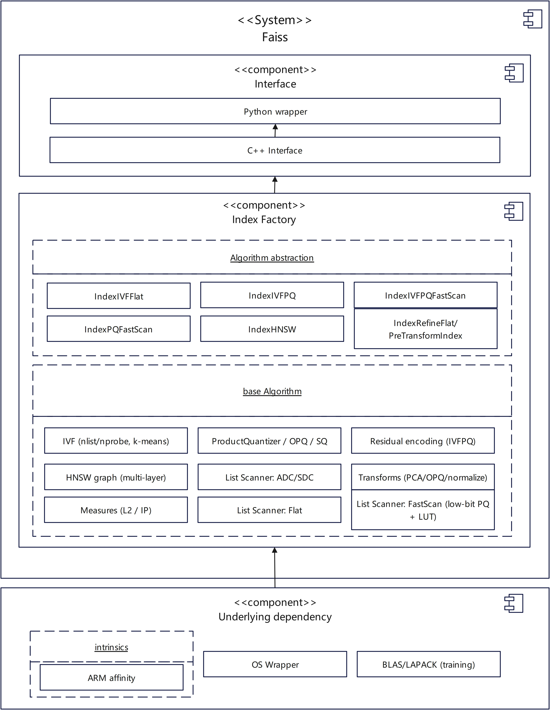

# Feature Introduction

## Architecture

This document describes the logical structure of the main Faiss algorithms, as well as the definitions and functions of the modules.
The Faiss system consists of three major layers: the API layer, the index factory layer, and underlying dependencies. Built with a C++ core, it provides upper-tier invocations via a Python wrapper. The index factory layer includes two sub-layers: algorithm abstraction, which encapsulates index types such as HNSW, IVF, PQ, and their combinations, and basic algorithms, which provide the underlying data structures and computing methods.

Core indexing capabilities:

- HNSW implements efficient approximate nearest neighbor (ANN) search via multi-layer navigable small-world graphs.
- IVF divides the vector space using K-means clustering to narrow down the search scope.
- PQ/SQ provides vector compression capabilities to significantly reduce memory footprint.
- FastScan leverages SIMD instructions to accelerate distance computations.
- Refine enables two-phase retrieval capabilities for coarse-grained ranking and fine-grained reranking.

While keeping the native Faiss APIs completely unchanged, extended APIs are introduced to enable FP16 acceleration.
The following figure shows the logical architecture and functional modules of Faiss.

**Figure 1** Faiss logical architecture

<table><thead align="left"><tr id="row10409145645519"><th class="cellrowborder" valign="top" width="50%" id="mcps1.1.3.1.1">
Module

</th>
<th class="cellrowborder" valign="top" width="50%" id="mcps1.1.3.1.2">
Function

</th>
</tr>
</thead>
<tbody><tr id="row940925645518"><td class="cellrowborder" valign="top" width="50%" headers="mcps1.1.3.1.1 ">
C++ interface

</td>
<td class="cellrowborder" valign="top" width="50%" headers="mcps1.1.3.1.2 ">
External interface for Faiss algorithms, through which the Python wrapper invokes underlying implementations.

</td>
</tr>
<tr id="row04102561556"><td class="cellrowborder" valign="top" width="50%" headers="mcps1.1.3.1.1 ">
IndexHNSW

</td>
<td class="cellrowborder" valign="top" width="50%" headers="mcps1.1.3.1.2 ">
Index implementation based on multi-layer navigable small-world graphs. It routes down rapidly layer by layer from the top during queries to balance search efficiency and recall rate.

</td>
</tr>
<tr id="row194101156165515"><td class="cellrowborder" valign="top" width="50%" headers="mcps1.1.3.1.1 ">
IndexIVFFlat

</td>
<td class="cellrowborder" valign="top" width="50%" headers="mcps1.1.3.1.2 ">
Inverted file index + Flat storage. It narrows down the candidate scope through IVF clustering first, and then performs exact distance computations on candidate vectors.

</td>
</tr>
<tr id="row12410185620555"><td class="cellrowborder" valign="top" width="50%" headers="mcps1.1.3.1.1 ">
IndexIVFPQ

</td>
<td class="cellrowborder" valign="top" width="50%" headers="mcps1.1.3.1.2 ">
Inverted file index + Product Quantization (PQ). It performs PQ compression on residual vectors after clustering, suitable for ultra-large-scale datasets.

</td>
</tr>
<tr id="row1410115614559"><td class="cellrowborder" valign="top" width="50%" headers="mcps1.1.3.1.1 ">
IndexPQFastScan / IndexIVFPQFastScan

</td>
<td class="cellrowborder" valign="top" width="50%" headers="mcps1.1.3.1.2 ">
SIMD-accelerated versions of PQ indexing. It implements fast distance computation using low-bit PQ and look-up table (LUT).

</td>
</tr>
<tr id="row2410105685518"><td class="cellrowborder" valign="top" width="50%" headers="mcps1.1.3.1.1 ">
IndexRefineFlat / PreTransformIndex

</td>
<td class="cellrowborder" valign="top" width="50%" headers="mcps1.1.3.1.2 ">
Two-phase retrieval: the first phase uses a coarse index to quickly filter candidate sets, and the second phase uses Flat exact distance for re-ranking. PreTransform supports PCA/OPQ preprocessing and transformation.

</td>
</tr>
<tr id="row19410125616551"><td class="cellrowborder" valign="top" width="50%" headers="mcps1.1.3.1.1 ">
HNSW graph (multi-layer)

</td>
<td class="cellrowborder" valign="top" width="50%" headers="mcps1.1.3.1.2 ">
Implementation of the HNSW multi-layer graph structure. The upper layers are sparse for fast routing, and the lower layers are dense for precise search.

</td>
</tr>
<tr id="row1790516495615"><td class="cellrowborder" valign="top" width="50%" headers="mcps1.1.3.1.1 ">
IVF (nlist/nprobe, k-means)

</td>
<td class="cellrowborder" valign="top" width="50%" headers="mcps1.1.3.1.2 ">
Basic algorithm of inverted files. It divides the vector space into <code>nlist</code> cells via K-means, and searches the <code>nprobe</code> nearest cells during queries.

</td>
</tr>
<tr id="row859311016564"><td class="cellrowborder" valign="top" width="50%" headers="mcps1.1.3.1.1 ">
ProductQuantizer / OPQ / SQ

</td>
<td class="cellrowborder" valign="top" width="50%" headers="mcps1.1.3.1.2 ">
Vector compression techniques: PQ quantizes vectors by segment, OPQ is rotationally optimized PQ, and SQ is scalar quantization.

</td>
</tr>
<tr id="row1321914912563"><td class="cellrowborder" valign="top" width="50%" headers="mcps1.1.3.1.1 ">
Measures (L2 / IP)

</td>
<td class="cellrowborder" valign="top" width="50%" headers="mcps1.1.3.1.2 ">
Provides implementations for two distance metrics: L2 Euclidean distance and Inner Product (IP) distance.

</td>
</tr>
<tr id="row17208117155612"><td class="cellrowborder" valign="top" width="50%" headers="mcps1.1.3.1.1 ">
List Scanner (Flat / ADC / FastScan)

</td>
<td class="cellrowborder" valign="top" width="50%" headers="mcps1.1.3.1.2 ">
 List scanner: Flat is used for exact computation, ADC is used for PQ asymmetric distance computation, and FastScan uses SIMD instructions for acceleration.

</td>
</tr>
<tr id="row864515315561"><td class="cellrowborder" valign="top" width="50%" headers="mcps1.1.3.1.1 ">
Transforms (PCA/OPQ/normalize)

</td>
<td class="cellrowborder" valign="top" width="50%" headers="mcps1.1.3.1.2 ">
Vector preprocessing transformations, including PCA dimensionality reduction, OPQ, and vector normalization.

</td>
</tr>
</tbody>
</table>

## Optimization Description

### Non-Equivalence Optimization

| Optimization| Description|
|--------|-----------|
| LUT-based accumulation| The LUT accumulation operator is a critical hotspot operator in inverted index and exhaustive scan, often causing computational bottlenecks. Distance accumulation with sign extension requires additional registers, which reduces the degree of instruction unrolling and introduces redundant computational overhead. To address this, in-memory data layout is reordered to fully utilize the 256-bit wide registers. This approach minimizes temporary register overhead, increases the degree of instruction unrolling, and eliminates redundant computations (bit-width extension). By reducing the use of 16 registers, the pipeline utilization is improved, and the computation latency is reduced.|
| Vector filtering and compression| The filtering and compression process involves numerous intermediate steps when calculating bitmaps, creating a bottleneck. A large portion of the intermediate data is invalid, leading to less than 50% average utilization of register bit-width. This optimization leverages SVE predicates and the 256-bit register width feature to bypass intermediate steps.|
| Distance computation optimization| In distance computation, the query vector is repeatedly accessed, making the memory access latency a system bottleneck. By computing the distances between one query and multiple base vectors simultaneously, the read latency of the query vector is significantly reduced.|
| Progressive reranking| PQ phase: This is a vector compression method that can reduce memory usage. However, 4-bit quantization leads to a certain decline in precision. After PQ coarse filtering, reranking is required to recover the lost precision. During reranking, SQ8 is used for fast distance computation first, and then FP32 is used to accurately compute the top N closest distances, improving computation efficiency.|
| Memory data rearrangement| In distance computation, the memory access to base vectors is non-contiguous. Cache miss causes memory access to become a system bottleneck. The data layout is adjusted to enable streaming memory access, cooperating with prefetching to reduce cache misses and memory access latency.|

### IVFPQ Optimization

| Optimization| Description|
|--------|-----------|
| LUT-based accumulation| The LUT accumulation operator is a critical hotspot operator in inverted index and exhaustive scan, often causing computational bottlenecks. Distance accumulation with sign extension requires additional registers, which reduces the degree of instruction unrolling and introduces redundant computational overhead. To address this, in-memory data layout is reordered to fully utilize the 256-bit wide registers. This approach minimizes temporary register overhead, increases the degree of instruction unrolling, and eliminates redundant computations. Hand-coded assembly is leveraged to implement multi-code parallelism and batch unrolling of multiple subquantizers, further reducing loop and address update overhead. For the random access feature of the PQ table, manual instruction scheduling and software prefetching are performed to maximize memory-level parallelism and reduce calculation latency.|
| Vector multiply-accumulate optimization| Vector multiply-accumulate is the core operator for distance computation. When data alignment conditions are met, the optimization path is enabled: increasing the data volume processed per iteration, and optimizing load/compute/store pipeline orchestration to shorten the instruction dependency chain. A non-temporal write policy is adopted to reduce cache pollution and improve write bandwidth efficiency.|

### HNSW FP16 Support

| Optimization| Description|
|--------|-----------|
| HNSW FP16 interface supported| The FP16 data type reduces the storage space of each vector component from 4 bytes in FP32 to 2 bytes. This significantly reduces the memory space required for building HNSW indexes, allowing for the processing of larger vector datasets under limited hardware resources. In addition, optimized for the Kunpeng Arm architecture, the FP16 distance computation algorithm improves the efficiency of node distance comparison during graph retrieval, reducing memory footprint.|
