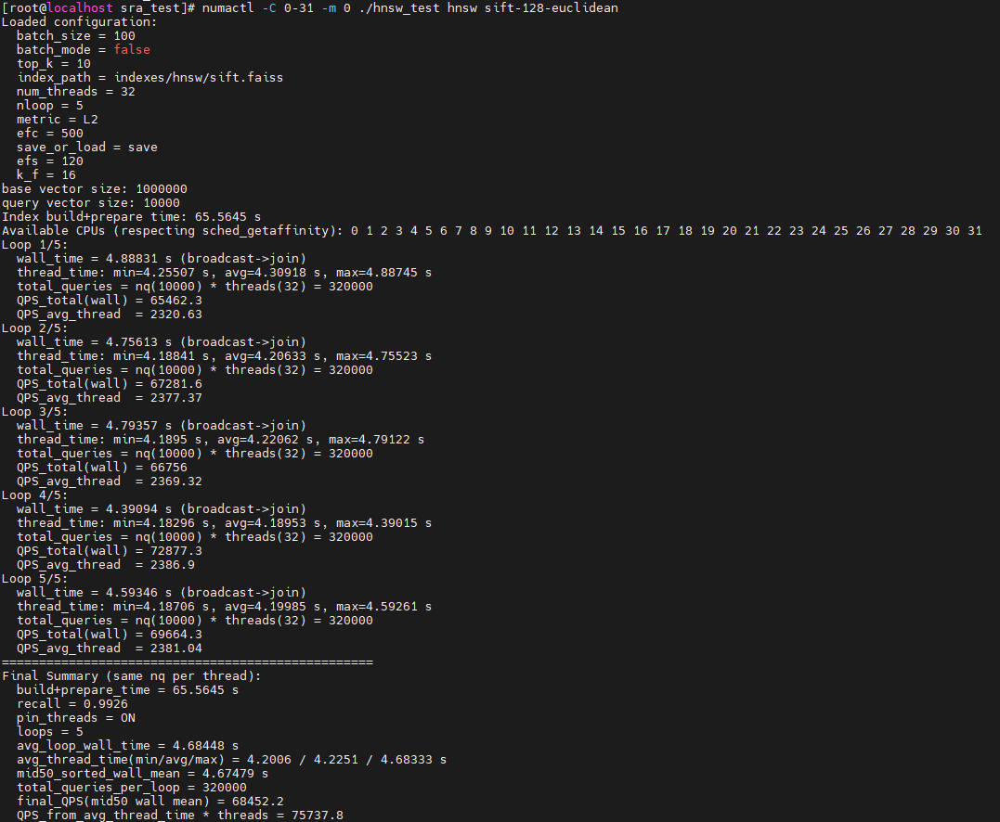

# Installation Guide

<!-- md-trans-meta sourceCommit=f37b02b5e16979c51738f39f4644194f3b94deff translatedAt=2026-08-06T08:58:40.115Z pushedAt=2026-08-07T01:07:09.484Z -->

## Verified Environments

To use Faiss smoothly and securely, ensure that your environment is one of the verified environments.

**Table 1** Verified environments for Faiss<a id="verified-environments-for-faiss "></a>

<a name="table4692134313211"></a>

<table><thead align="left"><tr id="row1169294312212"><th class="cellrowborder" valign="top" width="21.8%" id="mcps1.2.6.1.1"><p id="p12692144313211"><a name="p12692144313211"></a><a name="p12692144313211"></a>OS</p></th>
<th class="cellrowborder" valign="top" width="19.91%" id="mcps1.2.6.1.2"><p id="p06926438214"><a name="p06926438214"></a><a name="p06926438214"></a>CPU</p></th>
<th class="cellrowborder" valign="top" width="13.700000000000001%" id="mcps1.2.6.1.3"><p id="p269284310216"><a name="p269284310216"></a><a name="p269284310216"></a>Memory</p></th>
<th class="cellrowborder" valign="top" width="17.34%" id="mcps1.2.6.1.4"><p id="p196922434215"><a name="p196922434215"></a><a name="p196922434215"></a>Compiler</p></th>
<th class="cellrowborder" valign="top" width="27.250000000000004%" id="mcps1.2.6.1.5"><p id="p1769219435210"><a name="p1769219435210"></a><a name="p1769219435210"></a>Remarks</p></th>
</tr>
</thead>
<tbody><tr id="row624713534398"><td class="cellrowborder" valign="top" width="21.8%" headers="mcps1.2.6.1.1 "><p id="p418818120409"><a name="p418818120409"></a><a name="p418818120409"></a>openEuler 22.03 LTS SP3</p></td>
<td class="cellrowborder" valign="top" width="19.91%" headers="mcps1.2.6.1.2 "><p id="p468512464216"><a name="p468512464216"></a><a name="p468512464216"></a>New Kunpeng 920 processor model</p></td>
<td class="cellrowborder" valign="top" width="13.700000000000001%" headers="mcps1.2.6.1.3 "><p id="p56685294911"><a name="p56685294911"></a><a name="p56685294911"></a>16 × 32 GB</p></td>
<td class="cellrowborder" valign="top" width="17.34%" headers="mcps1.2.6.1.4 "><p id="p1118821124015"><a name="p1118821124015"></a><a name="p1118821124015"></a>GCC 12.3.1</p></td>
<td class="cellrowborder" valign="top" width="27.250000000000004%" headers="mcps1.2.6.1.5 "><p id="p18389155712168"><a name="p18389155712168"></a><a name="p18389155712168"></a>CMake&gt;= 3.22.0</p></td>
</tr>
<tr id="row8219349894"><td class="cellrowborder" valign="top" width="21.8%" headers="mcps1.2.6.1.1 "><p id="p1321915499910"><a name="p1321915499910"></a><a name="p1321915499910"></a>Debian 12</p></td>
<td class="cellrowborder" valign="top" width="19.91%" headers="mcps1.2.6.1.2 "><p id="p152199497916"><a name="p152199497916"></a><a name="p152199497916"></a>New Kunpeng 920 processor model</p></td>
<td class="cellrowborder" valign="top" width="13.700000000000001%" headers="mcps1.2.6.1.3 "><p id="p1121911491393"><a name="p1121911491393"></a><a name="p1121911491393"></a>16 × 32 GB</p></td>
<td class="cellrowborder" valign="top" width="17.34%" headers="mcps1.2.6.1.4 "><p id="p172198491297"><a name="p172198491297"></a><a name="p172198491297"></a>GCC 12.2.0 / LLVM 16.0.6</p></td>
<td class="cellrowborder" valign="top" width="27.250000000000004%" headers="mcps1.2.6.1.5 "><p id="p19219164917914"><a name="p19219164917914"></a><a name="p19219164917914"></a>CMake&gt;=3.25.1</p></td>
</tr>
<tr id="row159615141350"><td class="cellrowborder" valign="top" width="21.8%" headers="mcps1.2.6.1.1 "><p id="p179611141352"><a name="p179611141352"></a><a name="p179611141352"></a>openEuler 24.03 LTS SP3</p></td>
<td class="cellrowborder" valign="top" width="19.91%" headers="mcps1.2.6.1.2 "><p id="p8961314756"><a name="p8961314756"></a><a name="p8961314756"></a>Kunpeng 950 processor</p></td>
<td class="cellrowborder" valign="top" width="13.700000000000001%" headers="mcps1.2.6.1.3 "><p id="p15961191418510"><a name="p15961191418510"></a><a name="p15961191418510"></a>24 × 64 GB</p></td>
<td class="cellrowborder" valign="top" width="17.34%" headers="mcps1.2.6.1.4 "><p id="p496115148515"><a name="p496115148515"></a><a name="p496115148515"></a>GCC 12.3.1</p></td>
<td class="cellrowborder" valign="top" width="27.250000000000004%" headers="mcps1.2.6.1.5 "><p id="p109611114654"><a name="p109611114654"></a><a name="p109611114654"></a>CMake&gt;=3.22.0</p></td>
</tr>
<tr id="row1837942531312"><td class="cellrowborder" valign="top" width="21.8%" headers="mcps1.2.6.1.1 "><p id="p1438015251131"><a name="p1438015251131"></a><a name="p1438015251131"></a>Debian 12</p></td>
<td class="cellrowborder" valign="top" width="19.91%" headers="mcps1.2.6.1.2 "><p id="p578363871318"><a name="p578363871318"></a><a name="p578363871318"></a>Kunpeng 950 processor</p></td>
<td class="cellrowborder" valign="top" width="13.700000000000001%" headers="mcps1.2.6.1.3 "><p id="p127833389131"><a name="p127833389131"></a><a name="p127833389131"></a>24 × 64 GB</p></td>
<td class="cellrowborder" valign="top" width="17.34%" headers="mcps1.2.6.1.4 "><p id="p821894241316"><a name="p821894241316"></a><a name="p821894241316"></a>GCC 12.2.0 / LLVM 16.0.6</p></td>
<td class="cellrowborder" valign="top" width="27.250000000000004%" headers="mcps1.2.6.1.5 "><p id="p1021810427131"><a name="p1021810427131"></a><a name="p1021810427131"></a>CMake&gt;=3.25.1</p></td>
</tr>
</tbody>
</table>

## Compilation and Installation

### v1.8.0

Obtain the Faiss open-source code from GitHub, install the necessary dependency tools and libraries, obtain the patch optimized for the Kunpeng platform from GitCode, and then recompile Faiss to apply the optimized features, thereby reducing computation latency and improving computation efficiency.

1. Obtain the Faiss open-source code. The tag is **v1.8.0**. Assume that the code is stored in `/path/to/faiss`.

    ```bash
    git clone --branch v1.8.0 --single-branch https://github.com/facebookresearch/faiss.git
    ```

2. Obtain the patch file optimized for Kunpeng. The tag is **v1.1.0**. Assume that the patch file is stored in `/path/to/faiss-patch`.

    ```bash
    git clone --branch v1.1.0 https://gitcode.com/boostkit/faiss.git faiss-patch
    ```

    > **NOTE:**
    >The following explains the patch files optimized for Kunpeng. Select a patch file as required.
    >- `0001-faiss_1.8.0-optimize-neq.patch`: non-equivalence optimization patch. It delivers optimal performance and ensures precision, but does not guarantee that the values or sequence of top K results are completely consistent with the original version.
    >- `0002-faiss_1.8.0-optimize-eqv.patch`: equivalence optimization patch. It ensures that the values and sequence of top K results are completely consistent with the original version.

3. Install Make, CMake, and GCC. The GCC 12 installation procedure applies to openEuler 22.03 LTS SP3. openEuler 24.03 LTS SP3 comes with GCC 12 pre-installed, so you only need to install Make and CMake.

    ```bash
    yum install make cmake gcc-toolset-12-gcc gcc-toolset-12-gcc-c++ gcc-toolset-12-libstdc++-static gcc-toolset-12-gcc-gfortran
    export PATH=/opt/openEuler/gcc-toolset-12/root/usr/bin/:$PATH
    export LD_LIBRARY_PATH=/opt/openEuler/gcc-toolset-12/root/usr/lib64/:$LD_LIBRARY_PATH
    ```

4. Faiss depends on the math library. Download the open-source OpenBLAS source code from the [GitHub repository](https://github.com/OpenMathLib/OpenBLAS.git) using the **v0.3.29** tag. Save the file to a path accessible to the compiler, such as `/path/to/OpenBLAS-0.3.29`.

    ```bash
    git clone --branch v0.3.29 --single-branch https://github.com/OpenMathLib/OpenBLAS.git
    ```

5. <a id="li880635723510"></a>Compile the source code to obtain the `libopenblas.so` file.

    ```bash
    cd /path/to/OpenBLAS-0.3.29/OpenBLAS
    make
    make install
    ```

    > **NOTE:**
    >You can run the `make install PREFIX=/path/to/openblas/install` command to specify the installation path `/path/to/openblas/install`. The default installation path is `/opt/OpenBLAS`.

6. Install the patch file `0001-faiss\_1.8.0-optimize-neq.patch` or `0002-faiss\_1.8.0-optimize-eqv.patch`.

    ```bash
    cd /path/to/faiss
    patch -p1 < /path/to/faiss-patch/0001-faiss_1.8.0-optimize-neq.patch
    # patch -p1 < /path/to/faiss-patch/0002-faiss_1.8.0-optimize-eqv.patch
    ```

    The full directory structure of Faiss after applying the patches is as follows:

    ```text
    faiss/
    ├─ benchs/                                     // Benchmark tests
    ├─ c_api/                                      // C language API wrapper
    ├─ cmake/                                      // CMake configuration module
    ├─ conda/                                      // Conda build scripts
    ├─ contrib/                                    // Python contribution modules
    ├─ demos/                                      // Demo programs
    ├─ faiss/
    │   ├─ CMakeLists.txt                          // Build configuration
    │   ├─ Index.h                                 // Abstract base class, unified interface
    │   ├─ IndexFlat.cpp                           // Brute-force search implementation
    │   ├─ IndexFlatCodes.h                        // Unified code storage base class (for PQ, SQ, etc.)
    │   ├─ IndexFlatCodes.cpp                      // Unified code storage base class implementation
    │   ├─ IndexFastScan.h                         // 4-bit PQ/AQ fast scan general interface
    │   ├─ IndexFastScan.cpp                       // 4-bit PQ/AQ fast scan general implementation
    │   ├─ IndexIVF.h                              // IVF base class interface
    │   ├─ IndexIVF.cpp                            // IVF base class + concrete implementation
    │   ├─ IndexIVFFlat.cpp                        // IVFFlat concrete implementation
    │   ├─ IndexIVFPQ.cpp                          // IVFPQ implementation
    │   ├─ IndexIVFFastScan.h                      // IVFPQFastScan interface
    │   ├─ IndexIVFFastScan.cpp                    // IVFPQFastScan (CPU) implementation
    │   ├─ IndexHNSW.h                             // HNSW index interface
    │   ├─ IndexHNSW.cpp                           // HNSW index implementation
    │   ├─ IndexRefine.h                           // Base + refinement combined index interface
    │   ├─ IndexRefine.cpp                         // Base + refinement combined index implementation
    │   ├─ impl/
    │   │   ├─ DistanceComputer.h                  // Distance computation abstract interface
    │   │   ├─ ProductQuantizer.h                  // Product Quantizer interface
    │   │   ├─ ProductQuantizer.cpp                // Product Quantizer implementation
    │   │   ├─ pq4_fast_scan.h                     // 4-bit PQ fast scan interface
    │   │   ├─ pq4_fast_scan_search_1.cpp          // 4-bit PQ fast scan single query implementation
    │   │   ├─ pq4_fast_scan_search_qbs.cpp        // 4-bit PQ fast scan batch query implementation
    │   │   ├─ HNSW.cpp                            // HNSW graph structure implementation
    │   │   ├─ index_read.cpp                      // Index deserialization implementation
    │   │   └─ simd_result_handlers.h              // SIMD result handler
    │   ├─ invlists/
    │   │   ├─ InvertedLists.h                     // Inverted list abstract interface
    │   │   └─ InvertedLists.cpp                   // Inverted list implementation
    │   ├─ utils/
    │   │   └─ distances_simd.cpp                  // SIMD L2/IP/L1/Linf implementation
    │   ├─ sra_krl/
    │   │   ├─ include/
    │   │   │   ├─ krl.h                           // Unified external API declaration
    │   │   │   ├─ krl_internal.h                  // Internal structures, macros, and SIMD helper implementation
    │   │   │   ├─ platform_macros.h               // Error codes, metric constants, and platform macros
    │   │   │   └─ safe_memory.h                   // Safe memory operations
    │   │   └─ src/
    │   │       ├─ Heap_sort.c                     // Top-K heap construction and dual-heap reordering implementation.
    │   │       ├─ IPdistance_simd.c               // Single-precision vector inner product SIMD implementation (batch 2/4/8/16).
    │   │       ├─ IPdistance_simd_f16.c           // float16 IP distance computation implementation.
    │   │       ├─ IPdistance_simd_f16f32.c        // float16 IP distance computation implementation (float output).
    │   │       ├─ IPdistance_simd_s8.c            // int8 IP distance computation implementation (int32/float output).
    │   │       ├─ L2distance_simd.c               // float L2 distance computation implementation (batch 2/4/8/16/24)
    │   │       ├─ L2distance_simd_f16.c           // float16 L2 distance computation implementation
    │   │       ├─ L2distance_simd_f16f32.c        // float16 L2 distance computation implementation (float output)
    │   │       ├─ L2distance_simd_u8.c            // uint8 L2 distance computation implementation (uint32/float output)
    │   │       ├─ matrix_block_transpose.c        // 4×4 block transpose kernel
    │   │       ├─ MinMax_quant.c                  // Quantization (fp16/u8/s8).
    │   │       ├─ NegaIPdistance_simd_f16f32.c    // float16 IP distance computation implementation (negated, float output).
    │   │       ├─ NegaIPdistance_simd_s8.c        // int8 IP distance computation implementation (negated, int32/float output).
    │   │       ├─ handle_IO.c                     // Handle serialization/deserialization (file I/O).
    │   │       ├─ krl_handles.c                   // Handle creation, initialization, cleanup, and pointer access.
    │   │       ├─ pq_search_with_table_4bit.c     // 4-bit table lookup
    │   │       ├─ pq_search_with_table_8bit.c     // 8-bit table lookup
    │   │       ├─ reorder_2_vectors.c             // Sparse/contiguous reordering
    │   │       └─ sve_search_codes.c              // 4-bit fp16 table lookup (SVE)
    │   ├─ cppcontrib/                             // C++ contribution module
    │   ├─ gpu/                                    // GPU subsystem
    │   └─ python/                                 // Python bindings
    ├─ misc/                                       // Miscellaneous tests
    ├─ tests/                                      // Unit tests
    ├─ tutorial/                                   // Tutorial examples
    ├─ CMakeLists.txt                              // Top-level build configuration
    ├─ CHANGELOG.md
    ├─ CODE_OF_CONDUCT.md
    ├─ CONTRIBUTING.md
    ├─ INSTALL.md
    ├─ LICENSE
    └─ README.md
    ```

7. Compile the Faiss code to obtain `libfaiss.so`. Note: You need to enable the Kunpeng optimization macro to improve performance.

    ```bash
    cd /path/to/faiss
    cmake -B build . \
      -DFAISS_ENABLE_GPU=OFF \
      -DBUILD_TESTING=OFF \
      -DBUILD_SHARED_LIBS=ON \
      -DCMAKE_BUILD_TYPE=Release \
      -DFAISS_OPT_LEVEL=generic \
      -DFAISS_ENABLE_PYTHON=OFF \
      -DMKL_LIBRARIES=/opt/OpenBLAS/lib/libopenblas.so
    make -C build -j faiss
    make -C build install
    ```

   - If you choose to use the non-equivalence optimization patch `0001-faiss_1.8.0-optimize-neq.patch`, you can enable either of the following macros to improve performance (the two macros are mutually exclusive):

     - `-DKRL=ON`: non-equivalence optimization for HNSW, IVFPQ, IVFPQFS, PQFS, and IVFFLAT. It delivers optimal performance and ensures precision, but does not guarantee that the values or sequence of top K results are completely consistent with the original version.

     - `-DOPTI_IVFPQ=ON`: specific optimization for IVFPQ. Its performance on IVFPQ indexes outperforms that of the KRL macro, and it ensures that the values and sequence of top K results are completely consistent with the original version.

   - If you choose to use the equivalence optimization patch `0002-faiss\_1.8.0-optimize-eqv.patch`, you can enable the following macro to improve performance:

     - `-DKRL=ON`: non-equivalence optimization for HNSW, IVFPQ, IVFPQFS, PQFS, and IVFFLAT. It ensures that the values and sequence of top K results are completely consistent with the original version.

    >
    >**Note:**
    >
    >- During compilation, you can add the compilation option `-DCMAKE_INSTALL_PREFIX=/path/to/faiss/install` to specify the installation path `/path/to/faiss/install`. The default installation path is `/usr/local`.
    >- The compilation option `-DMKL_LIBRARIES` must be set to the installation path of OpenBLAS in step [5](#li880635723510).
    >- If the message "CMake 3.23.1 or higher is required.  You are running version 3.22.0" is displayed, modify line 21 in the `/path/to/faiss/CMakeLists.txt` file by changing `cmake_minimum_required(VERSION 3.23.1 FATAL_ERROR)` to `cmake_minimum_required(VERSION 3.22.0 FATAL_ERROR)`.

### v1.14.3

Obtain the Faiss open-source code from GitHub, install the necessary dependency tools and libraries, obtain the patch optimized for the Kunpeng platform from GitCode, and then recompile Faiss to apply the optimized features, thereby reducing computation latency and improving computation efficiency.

1. Obtain the Faiss open-source code. The tag is **v1.14.3**. Assume that the code is stored in `/path/to/faiss`.

    ```bash
    git clone --branch v1.14.3 --single-branch https://github.com/facebookresearch/faiss.git
    ```

2. Obtain the patch file optimized for Kunpeng. The tag is **v1.1.0**. Assume that the patch file is stored in `/path/to/faiss-patch`.

    ```bash
    git clone --branch v1.1.0 https://gitcode.com/boostkit/faiss.git faiss-patch
    ```

    > **NOTE**
    >The Kunpeng optimization patch files are described as follows:
    >- 0001-faiss\_1.14.3-optimize-rabitq.patch: A RaBitQ index optimization patch based on v1.14.3, which ensures accuracy but does not guarantee that the Top-K values or order are fully consistent with the original.

3. Install Make, CMake, and GCC. The GCC 12 installation procedure applies to openEuler 22.03 LTS SP3. openEuler 24.03 LTS SP3 comes with GCC 12 pre-installed, so you only need to install Make and CMake.

    ```bash
    yum install make cmake gcc-toolset-12-gcc gcc-toolset-12-gcc-c++ gcc-toolset-12-libstdc++-static gcc-toolset-12-gcc-gfortran
    export PATH=/opt/openEuler/gcc-toolset-12/root/usr/bin/:$PATH
    export LD_LIBRARY_PATH=/opt/openEuler/gcc-toolset-12/root/usr/lib64/:$LD_LIBRARY_PATH
    ```

4. Faiss depends on the math library. Download the open-source OpenBLAS source code from the [GitHub repository](https://github.com/OpenMathLib/OpenBLAS.git) using the **v0.3.29** tag. Save the file to a path accessible to the compiler, such as `/path/to/OpenBLAS-0.3.29`.

    ```bash
    git clone --branch v0.3.29 --single-branch https://github.com/OpenMathLib/OpenBLAS.git
    ```

5. <a id="li880635723510"></a>Compile the source code to obtain the `libopenblas.so` file.

    ```bash
    cd /path/to/OpenBLAS-0.3.29/OpenBLAS
    make
    make install
    ```

    > **NOTE:**
    >You can run the `make install PREFIX=/path/to/openblas/install` command to specify the installation path `/path/to/openblas/install`. The default installation path is `/opt/OpenBLAS`.

6. Install the patch file 0001-faiss\_1.14.3-optimize-rabitq.patch.

    ```bash
    cd /path/to/faiss
    patch -p1 < /path/to/faiss-patch/0001-faiss_1.14.3-optimize-rabitq.patch
    ```

    The full directory structure of Faiss after applying the patches is as follows:

    ```text
    faiss/
    ├─ benchs/                                     // Benchmark tests
    ├─ c_api/                                      // C language API wrapper
    ├─ cmake/                                      // CMake configuration module
    ├─ conda/                                      // Conda build script
    ├─ contrib/                                    // Python contribution module
    ├─ demos/                                      // Demo programs
    ├─ faiss/
    │   ├─ CMakeLists.txt                          // Build configuration
    │   ├─ Index.h                                 // Abstract base class, unified interface
    │   ├─ IndexFlat.cpp                           // Brute-force search implementation
    │   ├─ IndexFlatCodes.h                        // Unified code storage base class (for PQ, SQ, etc.)
    │   ├─ IndexFlatCodes.cpp                      // Unified code storage base class implementation
    │   ├─ IndexFastScan.h                         // 4-bit PQ/AQ fast scan common interface
    │   ├─ IndexFastScan.cpp                       // 4-bit PQ/AQ fast scan general implementation
    │   ├─ IndexIVF.h                              // IVF base class interface
    │   ├─ IndexIVF.cpp                            // IVF base class + concrete implementation
    │   ├─ IndexIVFFlat.cpp                        // IVFFlat concrete implementation
    │   ├─ IndexIVFPQ.cpp                          // IVFPQ implementation
    │   ├─ IndexIVFFastScan.h                      // IVFPQFastScan interface
    │   ├─ IndexIVFFastScan.cpp                    // IVFPQFastScan (CPU) implementation
    │   ├─ IndexHNSW.h                             // HNSW index interface
    │   ├─ IndexHNSW.cpp                           // HNSW index implementation
    │   ├─ IndexRefine.h                           // baseline + refinement combined index interface
    │   ├─ IndexRefine.cpp                         // Benchmark + refine combined index implementation
    │   ├─ IndexRaBitQ.h                           // RaBitQ binary quantization index interface
    │   ├─ IndexRaBitQ.cpp                         // RaBitQ binary quantization index implementation
    │   ├─ IndexRaBitQFastScan.h                   // RaBitQ FastScan interface
    │   ├─ IndexRaBitQFastScan.cpp                 // RaBitQ FastScan implementation
    │   ├─ IndexIVFRaBitQ.h                        // IVF+RaBitQ index interface
    │   ├─ IndexIVFRaBitQ.cpp                      // IVF+RaBitQ index implementation
    │   ├─ IndexIVFRaBitQFastScan.h                // IVF+RaBitQ FastScan interface
    │   ├─ IndexIVFRaBitQFastScan.cpp              // IVF+RaBitQ FastScan implementation
    │   ├─ impl/
    │   │   ├─ DistanceComputer.h                  // Distance computation abstract interface
    │   │   ├─ ProductQuantizer.h                  // Product Quantizer interface
    │   │   ├─ ProductQuantizer.cpp                // Product Quantizer implementation
    │   │   ├─ pq4_fast_scan.h                     // 4-bit PQ fast scan interface
    │   │   ├─ pq4_fast_scan_search_1.cpp          // 4-bit PQ fast scan single query implementation
    │   │   ├─ pq4_fast_scan_search_qbs.cpp        // 4-bit PQ fast scan batch query implementation
    │   │   ├─ HNSW.cpp                            // HNSW graph structure implementation
    │   │   ├─ index_read.cpp                      // Index deserialization implementation
    │   │   └─ simd_result_handlers.h              // SIMD result handler
    │   ├─ invlists/
    │   │   ├─ InvertedLists.h                     // Inverted list abstract interface
    │   │   └─ InvertedLists.cpp                   // Inverted list implementation
    │   ├─ utils/
    │   │   └─ distances_simd.cpp                  // SIMD L2/IP/L1/Linf implementation
    │   ├─ sra_krl/
    │   │   ├─ include/
    │   │   │   ├─ krl.h                           // Unified external API declaration
    │   │   │   ├─ krl_heap.h                      // Heap structure interface
    │   │   │   ├─ krl_internal.h                  // Internal structures, macros, and SIMD helper implementation
    │   │   │   ├─ platform_macros.h               // Error codes, metric constants, and platform macros
    │   │   │   └─ safe_memory.h                   // Safe memory operations.
    │   │   └─ src/
    │   │       ├─ Heap_sort.c                     // Top-K heap construction and dual-heap reordering implementation.
    │   │       ├─ IPdistance_simd.c               // Single-precision vector inner product SIMD implementation (batch 2/4/8/16).
    │   │       ├─ IPdistance_simd_f16f32.c        // float16 IP distance computation implementation (float output).
    │   │       ├─ IPdistance_simd_s8.c            // int8 IP distance computation implementation (int32/float output).
    │   │       ├─ L2distance_simd.c               // float L2 distance computation implementation (batch 2/4/8/16/24)
    │   │       ├─ L2distance_simd_f16f32.c        // float16 L2 distance computation implementation (float output)
    │   │       ├─ L2distance_simd_u8.c            // uint8 L2 distance computation implementation (uint32/float output)
    │   │       ├─ MinMax_quant.c                  // Quantization (fp16/u8/s8)
    │   │       ├─ krl_handles.c                   // Handle creation, initialization, cleanup, and pointer access
    │   │       ├─ matrix_block_transpose.c        // 4×4 block transpose kernel
    │   │       ├─ pq_search_with_table_4bit.c     // 4-bit table lookup
    │   │       ├─ reorder_2_vectors.c             // sparse/contiguous reorder
    │   ├─ cppcontrib/                             // C++ contribution module
    │   ├─ gpu/                                    // GPU subsystem
    │   └─ python/                                 // Python bindings
    ├─ misc/                                       // Miscellaneous tests
    ├─ tests/                                      // Unit tests
    ├─ tutorial/                                   // Tutorial examples
    ├─ CMakeLists.txt                              // Top-level build configuration
    ├─ CHANGELOG.md
    ├─ CODE_OF_CONDUCT.md
    ├─ CONTRIBUTING.md
    ├─ INSTALL.md
    ├─ LICENSE
    └─ README.md
    ```

7. Compile the Faiss code to obtain `libfaiss.so`. Note: You need to enable the Kunpeng optimization macro to improve performance.

    ```bash
    cd /path/to/faiss
    cmake -B build . \
      -DFAISS_ENABLE_GPU=OFF \
      -DBUILD_TESTING=OFF \
      -DBUILD_SHARED_LIBS=ON \
      -DCMAKE_BUILD_TYPE=Release \
      -DFAISS_OPT_LEVEL=generic \
      -DFAISS_ENABLE_PYTHON=OFF \
      -DKRL=ON \
      -DMKL_LIBRARIES=/opt/OpenBLAS/lib/libopenblas.so
    make -C build -j faiss
    make -C build install
    ```

    >
    >**NOTE**
    >
    >- During compilation, you can add the compilation option **-DCMAKE_INSTALL_PREFIX=/path/to/faiss/install** to specify the installation path `/path/to/faiss/install`. The default installation path is `/usr/local`.
    >- The compilation option **-DMKL_LIBRARIES** must be set to the installation path of OpenBLAS in step [5](#li880635723510).
    >- If the message "CMake 3.23.1 or higher is required.  You are running version 3.22.0" is displayed, modify line 21 in the `/path/to/faiss/CMakeLists.txt` file by changing `cmake_minimum_required(VERSION 3.23.1 FATAL_ERROR)` to `cmake_minimum_required(VERSION 3.22.0 FATAL_ERROR)`.

## Compatibility Verification

This section describes how to verify the compatibility of the open-source Faiss with the Kunpeng platform. The example uses the `sift-128-euclidean.hdf5` dataset, Faiss-supported algorithm (HNSW), and 32 threads.

**Obtaining the Dataset and Test Program <a name="section5124167418"></a>**

1. Obtain the [test program](https://atomgit.com/openeuler/sra_test.git). The branch is **v2.1.0**. Assume that the program runs at the `/path/to/sra_test` directory. The full directory structure is as follows.

    ```text
    ├── configs                                                   // Stores configuration files for corresponding algorithms and datasets.
          └── hnsw
                └── hnsw_sift-128-euclidean.config 
    ├── include                                                   // Stores header files for the test framework.
          └── algo                                                // Index definitions for each algorithm.
          └── core                                                // Header files for data processing, test result processing, etc.
          └── framework                                           // Header files related to the test framework
    ├── src                                                       // Source files for the test framework
          └── algo                                                // Adaptation layer for each algorithm
          └── bench                                               // Unified test files
          └── core                                                // Files for data processing, test result processing, etc.
          └── registry                                            // Registration of algorithm factories
    ├── Makefile                                                  // Compilation script file
    ├── test.sh                                                   // Test script
    ├── test_muti-numas.sh                                        // Parallel test script
    ├── data                                                      // Store the dataset. (Manually create this directory and place the dataset inside.)
          └── sift-128-euclidean.hdf5
    ├── indexes
          └── hnsw                                                // Store the built index. (Manually create this directory.)
                └── sift.faiss                                    // The built index, generated when the executable hnsw_test is run and the save_or_load parameter in the dataset configuration file is set to save.
    └── hnsw_test                                                 // The executable file generated after compilation.
    ```

2. Obtain the dataset and save it to `/path/to/sra_test/data`.

    ```bash
    cd /path/to/sra_test/data
    wget http://ann-benchmarks.com/sift-128-euclidean.hdf5 --no-check-certificate
    ```

**Verifying the Compatibility with Open-Source Faiss<a name="section41250624115"></a>**

1. Install the dependencies.

    ```bash
    yum install hdf5 hdf5-devel numactl numactl-devel
    ```

2. Compile and install Faiss. Note that for open-source Faiss compatibility verification, you do not need to enable macros related to Kunpeng optimization.

3. Build the executable file. Enter the Faiss installation path and the paths to other required dependencies as prompted by the command line.

    ```bash
    make hnsw_test
    ```

    > **NOTE:**
    >During the test, select the appropriate compilation instruction for each algorithm.
    >- HNSW: `make hnsw_test`
    >- PQFS: `make pqfs_test`
    >- IVFPQ: `make ivfpq_test`
    >- IVFPQFS: `make ivfpqfs_test`
    >- IVFFLAT: `make ivfflat_test`

4. For the first run, ensure that <code>save_or_load</code> in the <code>hnsw_sift-128-euclidean.config</code> file is set to <code>save</code>. In subsequent runs, you can change it to <code>load</code> to use the built graph index or retriever for querying.

5. Run the executable file. Add the OpenBLAS and Faiss dynamic library paths to the environment variable.

    ```bash
    numactl -C 0-31 -m 0 ./hnsw_test hnsw sift-128-euclidean
    ```

The command output is as follows:


