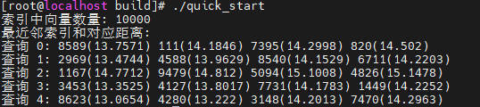
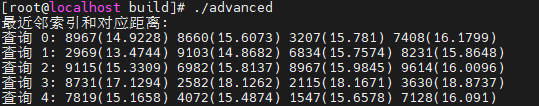

# Quick Start

This section provides a brief guide to getting started with the core functions of Faiss.

## Core Concepts

The core of Faiss is the index, a structure specifically designed to store vectors and efficiently perform similarity searches.

- Vectors: Open-source Faiss supports float32 vectors.
- Index types: For beginners, IndexFlatL2 (an exhaustive search index that yields exact results with no approximation, making it ideal for learning) is recommended. You can try IndexIVFFlat (an approximate search index for faster speed) later.
- Core workflow: Create an index → Add vectors to the index → Execute similarity search.

## Example

The following example demonstrates the core usage scenarios of Faiss, with inline comments and result parsing.

```cpp
#include <faiss/IndexFlat.h>
#include <iostream>
#include <vector>
#include <random>

int main() {
    // 1. Prepare data.
    int d = 128;
    int nb = 10000;
    int nq = 5;

    std::vector<float> db_vectors(nb * d);
    std::vector<float> query_vectors(nq * d);

    std::mt19937 rng(42);
    std::uniform_real_distribution<float> dist(0.0f, 1.0f);
    for (auto& v : db_vectors) v = dist(rng);
    for (auto& v : query_vectors) v = dist(rng);

    // 2. Create an index (IndexFlatL2: exhaustive search based on L2 distance).
    faiss::IndexFlatL2 index(d);

    // 3. Add vectors to the index.
    index.add(nb, db_vectors.data());
    std::cout << "Number of vectors in the index: " << index.ntotal << std::endl;

    // 4. Perform the search.
    int k = 4;
    std::vector<float> distances(nq * k);
    std::vector<faiss::idx_t> indices(nq * k);

    index.search(nq, query_vectors.data(), k, distances.data(), indices.data());

    // 5. Parse the results.
    std::cout << "Nearest neighbor indices and distances: " << std::endl;
    for (int i = 0; i < nq; i++) {
        std::cout << "Query " << i << ": ";
        for (int j = 0; j < k; j++) {
            std::cout << indices[i * k + j] << "(" << distances[i * k + j] << ") ";
        }
        std::cout << std::endl;
    }

    return 0;
}
```

The expected output is as follows:



## Advanced Extension

IndexIVFFlat: suitable for large datasets. The core mechanism is to cluster data before searching.

```cpp
#include <faiss/IndexFlat.h>
#include <faiss/IndexIVFFlat.h>
#include <iostream>
#include <vector>
#include <random>

int main() {
    int d = 128;
    int nb = 10000;
    int nq = 5;
    int nlist = 100;

    std::vector<float> db_vectors(nb * d);
    std::vector<float> query_vectors(nq * d);

    std::mt19937 rng(42);
    std::uniform_real_distribution<float> dist(0.0f, 1.0f);
    for (auto& v : db_vectors) v = dist(rng);
    for (auto& v : query_vectors) v = dist(rng);

    // Create a quantizer and an IVF index.
    faiss::IndexFlatL2* quantizer = new faiss::IndexFlatL2(d);
    faiss::IndexIVFFlat ivf_index(quantizer, d, nlist);

    ivf_index.train(nb, db_vectors.data());
    ivf_index.add(nb, db_vectors.data());

    // Perform the search.
    int k = 4;
    std::vector<float> distances(nq * k);
    std::vector<faiss::idx_t> indices(nq * k);
    ivf_index.search(nq, query_vectors.data(), k, distances.data(), indices.data());

    // Parse the results.
    std::cout << "Nearest neighbor indices and distances: " << std::endl;
    for (int i = 0; i < nq; i++) {
        std::cout << "Query " << i << ": ";
        for (int j = 0; j < k; j++) {
            std::cout << indices[i * k + j] << "(" << distances[i * k + j] << ") ";
        }
        std::cout << std::endl;
    }

    return 0;
}
```

The expected output is as follows:


