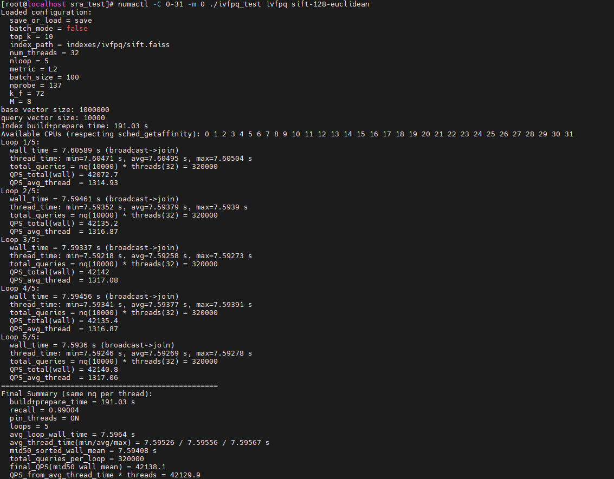
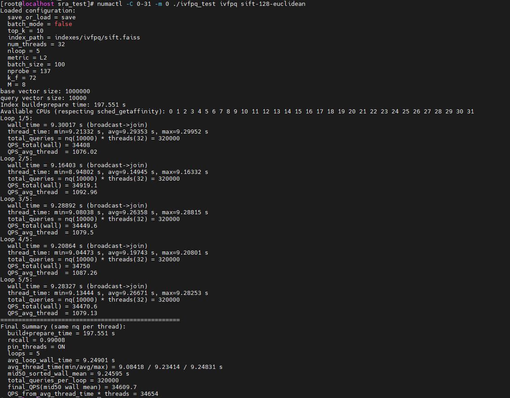

# 最佳实践

## 全量优化

本节介绍在鲲鹏平台测试全量优化后Faiss的方法，依赖鲲鹏的全量优化补丁文件0001-faiss\_1.8.0-optimize-neq.patch。使用示例为sift-128-euclidean.hdf5数据集，Faiss（IVFPQ）算法，线程数32。

**获取数据集与测试程序<a name="section5124167418"></a>**

1. 获取[测试程序](https://atomgit.com/openeuler/sra_test.git)。分支为**v2.0.0**，假设程序运行的目录为“/path/to/sra\_test“，完整的目录结构应如下所示：

    ```text
    ├── configs                                                   // 存放对应算法和数据集配置文件
          └── ivfpq
                └── ivfpq_sift-128-euclidean.config 
    ├── include                                                   // 存放测试框架对应的头文件
          └── algo                                                // 各算法Index定义
          └── core                                                // 数据处理、测试结果处理等头文件
          └── framework                                           // 测试框架相关头文件
    ├── src                                                       // 存放测试框架对应的源文件
          └── algo                                                // 各算法适配层
          └── bench                                               // 统一测试文件
          └── core                                                // 数据处理、测试结果处理等文件
          └── registry                                            // 各算法工厂注册
    ├── Makefile                                                  // 编译脚本文件
    ├── test.sh                                                   // 测试脚本
    ├── test_muti-numas.sh                                        // 并行测试脚本
    ├── data                                                      // 存放数据集（需手动创建并存放数据集）
          └── sift-128-euclidean.hdf5
    ├── indexes
          └── ivfpq                                               // 存放构建好的索引（需手动创建）
                └── sift.faiss                                    // 构建好的索引，当运行可执行文件ivfpq_test且数据集配置文件中save_or_load参数设置为save时生成
    └── ivfpq_test                                                // 编译后生成的可执行文件
    ```

2. <a name="li1673311431218"></a>获取数据集，存放于“/path/to/sra\_test/data“。

    ```bash
    cd /path/to/sra_test/data
    wget http://ann-benchmarks.com/sift-128-euclidean.hdf5 --no-check-certificate
    ```

**全量优化后Faiss测试<a name="section41250624115"></a>**

1. 安装相关依赖。

    ```bash
    yum install hdf5 hdf5-devel numactl numactl-devel
    ```

2. 请参考《[安装指南](./installation_guide.md)》编译安装Faiss。
   >**说明：** 作为全量优化后Faiss测试，需开启与鲲鹏优化相关的宏，此处以 **-DOPTI\_IVFPQ=ON**为例。
3. 编译可执行文件。根据命令行提示输入Faiss安装路径及其他所需依赖所在路径。注意，请根据命令行提示同步开 **-DOPTI\_IVFPQ=ON** 。若步骤[2](#li1673311431218)选择开启  **-DKRL=ON**，则此处也需同步开启。

    ```bash
    make ivfpq_test
    ```

    > **说明：** 
    >测试时不同的算法需要选择不同的编译指令：
    >- HNSW算法：**make hnsw\_test**
    >- HNSW算法（FP16）：**make hnsw\_fp16_test**
    >- PQFS算法：**make pqfs\_test**
    >- IVFPQ算法：**make ivfpq\_test**
    >- IVFPQFS算法：**make ivfpqfs\_test**
    >- IVFFLAT算法：**make ivfflat\_test**

4. 若是第一次执行，确保ivfpq\_sift-128-euclidean.config文件中的“save\_or\_load“为“save“；后续执行时可改为“load“，使用构建好的图索引或检索器查询。
5. 运行可执行文件。将OpenBLAS与Faiss动态库路径添加至环境变量。

    ```bash
    numactl -C 0-31 -m 0 ./ivfpq_test ivfpq sift-128-euclidean
    ```

测试结果如下所示：



## 等价优化

本节介绍在鲲鹏平台测试等价优化后Faiss的方法，依赖鲲鹏的等价优化补丁文件0002-faiss\_1.8.0-optimize-eqv.patch。使用示例为sift-128-euclidean.hdf5数据集，Faiss（IVFPQ）算法，线程数32。

**获取数据集与测试程序<a name="section5124167418"></a>**

1. 获取[测试程序](https://atomgit.com/openeuler/sra_test.git)。分支为**v2.0.0**，假设程序运行的目录为“/path/to/sra\_test“，完整的目录结构应如下所示：

    ```text
    ├── configs                                                   // 存放对应算法和数据集配置文件
          └── ivfpq
                └── ivfpq_sift-128-euclidean.config 
    ├── include                                                   // 存放测试框架对应的头文件
          └── algo                                                // 各算法Index定义
          └── core                                                // 数据处理、测试结果处理等头文件
          └── framework                                           // 测试框架相关头文件
    ├── src                                                       // 存放测试框架对应的源文件
          └── algo                                                // 各算法适配层
          └── bench                                               // 统一测试文件
          └── core                                                // 数据处理、测试结果处理等文件
          └── registry                                            // 各算法工厂注册
    ├── Makefile                                                  // 编译脚本文件
    ├── test.sh                                                   // 测试脚本
    ├── test_muti-numas.sh                                        // 并行测试脚本
    ├── data                                                      // 存放数据集（需手动创建并存放数据集）
          └── sift-128-euclidean.hdf5
    ├── indexes
          └── ivfpq                                               // 存放构建好的索引（需手动创建）
                └── sift.faiss                                    // 构建好的索引，当运行可执行文件ivfpq_test且数据集配置文件中save_or_load参数设置为save时生成
    └── ivfpq_test                                                // 编译后生成的可执行文件
    ```

2. 获取数据集，存放于“/path/to/sra\_test/data“。

    ```bash
    cd /path/to/sra_test/data
    wget http://ann-benchmarks.com/sift-128-euclidean.hdf5 --no-check-certificate
    ```

**等价优化后Faiss测试<a name="section41250624115"></a>**

1. 安装相关依赖。

    ```bash
    yum install hdf5 hdf5-devel numactl numactl-devel
    ```

2. 请参考《[安装指南](./installation_guide.md)》编译安装Faiss。
   > **说明：** 作为等价优化后Faiss测试，需开启与鲲鹏优化相关的宏 **-DKRL=ON**。
3. 编译可执行文件。根据命令行提示输入Faiss安装路径及其他所需依赖所在路径。注意，请根据命令行提示同步开启 **-DKRL=ON**。

    ```bash
    make ivfpq_test
    ```

    > **说明：** 
    >测试时不同的算法需要选择不同的编译指令：
    >- HNSW算法：**make hnsw\_test**
    >- HNSW算法（FP16）：**make hnsw\_fp16_test**
    >- PQFS算法：**make pqfs\_test**
    >- IVFPQ算法：**make ivfpq\_test**
    >- IVFPQFS算法：**make ivfpqfs\_test**
    >- IVFFLAT算法：**make ivfflat\_test**

4. 若是第一次执行，确保ivfpq\_sift-128-euclidean.config文件中的“save\_or\_load“为“save“；后续执行时可改为“load“，使用构建好的图索引或检索器查询。
5. 运行可执行文件。将OpenBLAS与Faiss动态库路径添加至环境变量。

    ```bash
    numactl -C 0-31 -m 0 ./ivfpq_test ivfpq sift-128-euclidean
    ```

测试结果如下所示：



## HNSW FP16支持

本节介绍在鲲鹏平台测试HNSW支持FP16接口后Faiss的方法，依赖鲲鹏的优化补丁文件0001-faiss\_1.8.0-optimize-neq.patch或0002-faiss\_1.8.0-optimize-eqv.patch。使用示例为sift-128-euclidean.hdf5数据集，Faiss（HNSW）算法，线程数32。

**获取数据集与测试程序<a name="section5124167418"></a>**

1. 获取[测试程序](https://atomgit.com/openeuler/sra_test.git)。分支为**v2.0.0**，假设程序运行的目录为“/path/to/sra\_test“，完整的目录结构应如下所示：

    ```text
    ├── configs                                                   // 存放对应算法和数据集配置文件
          └── hnsw
                └── hnsw_sift-128-euclidean.config 
    ├── include                                                   // 存放测试框架对应的头文件
          └── algo                                                // 各算法Index定义
          └── core                                                // 数据处理、测试结果处理等头文件
          └── framework                                           // 测试框架相关头文件
    ├── src                                                       // 存放测试框架对应的源文件
          └── algo                                                // 各算法适配层
          └── bench                                               // 统一测试文件
          └── core                                                // 数据处理、测试结果处理等文件
          └── registry                                            // 各算法工厂注册
    ├── Makefile                                                  // 编译脚本文件
    ├── test.sh                                                   // 测试脚本
    ├── test_muti-numas.sh                                        // 并行测试脚本
    ├── data                                                      // 存放数据集（需手动创建并存放数据集）
          └── sift-128-euclidean.hdf5
    ├── indexes
          └── hnsw-fp16                                           // 存放构建好的索引（需手动创建）
                └── sift.faiss                                    // 构建好的索引，当运行可执行文件hnsw_test且数据集配置文件中save_or_load参数设置为save时生成
    └── hnsw_fp16_test                                            // 编译后生成的可执行文件
    ```

2. 获取数据集，存放于“/path/to/sra\_test/data“。

    ```bash
    cd /path/to/sra_test/data
    wget http://ann-benchmarks.com/sift-128-euclidean.hdf5 --no-check-certificate
    ```

**HNSW支持FP16接口测试<a name="section41250624115"></a>**

1. 安装相关依赖。

    ```bash
    yum install hdf5 hdf5-devel numactl numactl-devel
    ```

2. 请参考《[安装指南](./installation_guide.md)》编译安装Faiss。
3. 编译可执行文件。根据命令行提示输入Faiss安装路径及其他所需依赖所在路径。注意，请根据根据命令行提示同步开启 **-DKRL=ON -DUSE\_FP16=ON**。

    ```bash
    make hnsw_fp16_test
    ```

    > **说明：** 
    >测试时不同的算法需要选择不同的编译指令：
    >- HNSW算法：**make hnsw\_test**
    >- HNSW算法（FP16）：**make hnsw\_fp16_test**
    >- PQFS算法：**make pqfs\_test**
    >- IVFPQ算法：**make ivfpq\_test**
    >- IVFPQFS算法：**make ivfpqfs\_test**
    >- IVFFLAT算法：**make ivfflat\_test**

4. 若是第一次执行，确保hnsw\_sift-128-euclidean.config文件中的“save\_or\_load“为“save“；后续执行时可改为“load“，使用构建好的图索引或检索器查询。
5. 运行可执行文件。将OpenBLAS与Faiss动态库路径添加至环境变量。

    ```bash
    numactl -C 0-31 -m 0 ./hnsw_fp16_test hnsw_fp16 sift-128-euclidean
    ```

测试结果如下所示：


