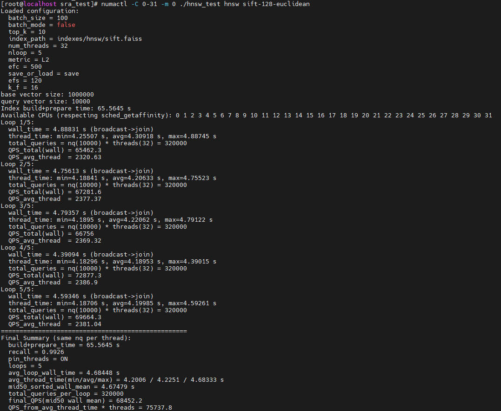

# 安装指南

## 已验证环境

为保证您可以顺利安全地使用Faiss，请确保所使用的环境信息在已验证环境范围内。

**表 1** Faiss已验证环境<a id="Faiss已验证环境"></a>

<a name="table4692134313211"></a>
<table><thead align="left"><tr id="row1169294312212"><th class="cellrowborder" valign="top" width="21.8%" id="mcps1.2.6.1.1"><p id="p12692144313211"><a name="p12692144313211"></a><a name="p12692144313211"></a>操作系统</p>
</th>
<th class="cellrowborder" valign="top" width="19.91%" id="mcps1.2.6.1.2"><p id="p06926438214"><a name="p06926438214"></a><a name="p06926438214"></a>CPU类型</p>
</th>
<th class="cellrowborder" valign="top" width="13.700000000000001%" id="mcps1.2.6.1.3"><p id="p269284310216"><a name="p269284310216"></a><a name="p269284310216"></a>内存</p>
</th>
<th class="cellrowborder" valign="top" width="17.34%" id="mcps1.2.6.1.4"><p id="p196922434215"><a name="p196922434215"></a><a name="p196922434215"></a>编译器</p>
</th>
<th class="cellrowborder" valign="top" width="27.250000000000004%" id="mcps1.2.6.1.5"><p id="p1769219435210"><a name="p1769219435210"></a><a name="p1769219435210"></a>其他</p>
</th>
</tr>
</thead>
<tbody><tr id="row624713534398"><td class="cellrowborder" valign="top" width="21.8%" headers="mcps1.2.6.1.1 "><p id="p418818120409"><a name="p418818120409"></a><a name="p418818120409"></a>openEuler 22.03 LTS SP3</p>
</td>
<td class="cellrowborder" valign="top" width="19.91%" headers="mcps1.2.6.1.2 "><p id="p468512464216"><a name="p468512464216"></a><a name="p468512464216"></a>鲲鹏920 7282C处理器</p>
</td>
<td class="cellrowborder" valign="top" width="13.700000000000001%" headers="mcps1.2.6.1.3 "><p id="p56685294911"><a name="p56685294911"></a><a name="p56685294911"></a>16*32GB</p>
</td>
<td class="cellrowborder" valign="top" width="17.34%" headers="mcps1.2.6.1.4 "><p id="p1118821124015"><a name="p1118821124015"></a><a name="p1118821124015"></a>GCC 12.3.1</p>
</td>
<td class="cellrowborder" valign="top" width="27.250000000000004%" headers="mcps1.2.6.1.5 "><p id="p18389155712168"><a name="p18389155712168"></a><a name="p18389155712168"></a>CMake&gt;=3.22.0</p>
</td>
</tr>
<tr id="row8219349894"><td class="cellrowborder" valign="top" width="21.8%" headers="mcps1.2.6.1.1 "><p id="p1321915499910"><a name="p1321915499910"></a><a name="p1321915499910"></a>Debian 12</p>
</td>
<td class="cellrowborder" valign="top" width="19.91%" headers="mcps1.2.6.1.2 "><p id="p152199497916"><a name="p152199497916"></a><a name="p152199497916"></a>鲲鹏920 7282C处理器</p>
</td>
<td class="cellrowborder" valign="top" width="13.700000000000001%" headers="mcps1.2.6.1.3 "><p id="p1121911491393"><a name="p1121911491393"></a><a name="p1121911491393"></a>16*32GB</p>
</td>
<td class="cellrowborder" valign="top" width="17.34%" headers="mcps1.2.6.1.4 "><p id="p172198491297"><a name="p172198491297"></a><a name="p172198491297"></a>GCC 12.2.0 / LLVM 16.0.6</p>
</td>
<td class="cellrowborder" valign="top" width="27.250000000000004%" headers="mcps1.2.6.1.5 "><p id="p19219164917914"><a name="p19219164917914"></a><a name="p19219164917914"></a>CMake&gt;=3.25.1</p>
</td>
</tr>
<tr id="row159615141350"><td class="cellrowborder" valign="top" width="21.8%" headers="mcps1.2.6.1.1 "><p id="p179611141352"><a name="p179611141352"></a><a name="p179611141352"></a>openEuler 24.03 LTS SP3</p>
</td>
<td class="cellrowborder" valign="top" width="19.91%" headers="mcps1.2.6.1.2 "><p id="p8961314756"><a name="p8961314756"></a><a name="p8961314756"></a>鲲鹏950 7592C处理器</p>
</td>
<td class="cellrowborder" valign="top" width="13.700000000000001%" headers="mcps1.2.6.1.3 "><p id="p15961191418510"><a name="p15961191418510"></a><a name="p15961191418510"></a>24*64GB</p>
</td>
<td class="cellrowborder" valign="top" width="17.34%" headers="mcps1.2.6.1.4 "><p id="p496115148515"><a name="p496115148515"></a><a name="p496115148515"></a>GCC 12.3.1</p>
</td>
<td class="cellrowborder" valign="top" width="27.250000000000004%" headers="mcps1.2.6.1.5 "><p id="p109611114654"><a name="p109611114654"></a><a name="p109611114654"></a>CMake&gt;=3.22.0</p>
</td>
</tr>
<tr id="row1837942531312"><td class="cellrowborder" valign="top" width="21.8%" headers="mcps1.2.6.1.1 "><p id="p1438015251131"><a name="p1438015251131"></a><a name="p1438015251131"></a>Debian 12</p>
</td>
<td class="cellrowborder" valign="top" width="19.91%" headers="mcps1.2.6.1.2 "><p id="p578363871318"><a name="p578363871318"></a><a name="p578363871318"></a>鲲鹏950 7592C处理器</p>
</td>
<td class="cellrowborder" valign="top" width="13.700000000000001%" headers="mcps1.2.6.1.3 "><p id="p127833389131"><a name="p127833389131"></a><a name="p127833389131"></a>24*64GB</p>
</td>
<td class="cellrowborder" valign="top" width="17.34%" headers="mcps1.2.6.1.4 "><p id="p821894241316"><a name="p821894241316"></a><a name="p821894241316"></a>GCC 12.2.0 / LLVM 16.0.6</p>
</td>
<td class="cellrowborder" valign="top" width="27.250000000000004%" headers="mcps1.2.6.1.5 "><p id="p1021810427131"><a name="p1021810427131"></a><a name="p1021810427131"></a>CMake&gt;=3.25.1</p>
</td>
</tr>
</tbody>
</table>

## 编译安装

从GitCode获取Faiss开源代码，安装必要的依赖工具、库，以及基于鲲鹏平台优化后的Patch然后重新编译Faiss，以便应用优化后特性，降低计算时延，提升计算效率。

1. 获取Faiss开源代码，标签为**v1.8.0**。假设代码存放于“/path/to/faiss“。

    ```bash
    git clone --branch v1.8.0 --single-branch https://github.com/facebookresearch/faiss.git
    ```

2. 获取基于鲲鹏优化的补丁文件，标签为**v1.0.0**。假设存放于“/path/to/faiss-patch“。

    ```bash
    git clone --branch v1.0.0 https://gitcode.com/boostkit/faiss.git faiss-patch
    ```

    > **说明：** 
    >鲲鹏优化补丁文件描述如下，请根据需要自行选择：
    >- 0001-faiss\_1.8.0-optimize-neq.patch：全量优化补丁，性能最优，保证精度，但不保证Top-K的值或顺序与原生完全一致。
    >- 0002-faiss\_1.8.0-optimize-eqv.patch：等价优化补丁，保证Top-K的值与顺序与原生保持完全一致。

3. 安装Make、CMake、GCC。GCC 12安装步骤适用于openEuler 22.03 LTS SP3系统，openEuler 24.03 LTS SP3系统自带GCC 12，仅安装Make、CMake。

    ```bash
    yum install make cmake gcc-toolset-12-gcc gcc-toolset-12-gcc-c++ gcc-toolset-12-libstdc++-static gcc-toolset-12-gcc-gfortran
    export PATH=/opt/openEuler/gcc-toolset-12/root/usr/bin/:$PATH
    export LD_LIBRARY_PATH=/opt/openEuler/gcc-toolset-12/root/usr/lib64/:$LD_LIBRARY_PATH
    ```

4. Faiss依赖数学库，从[GitHub仓](https://github.com/OpenMathLib/OpenBLAS.git)下载开源OpenBLAS源代码，标签为**v0.3.29**。保存在编译机器可访问的路径中，假设位于“/path/to/OpenBLAS-0.3.29“。

    ```bash
    git clone --branch v0.3.29 --single-branch https://github.com/OpenMathLib/OpenBLAS.git
    ```

5. <a name="li880635723510"></a>编译源代码获取libopenblas.so。

    ```bash
    cd /path/to/OpenBLAS-0.3.29/OpenBLAS
    make
    make install
    ```

    > **说明：** 
    >您可通过**make install PREFIX=/path/to/openblas/install**设置“/path/to/openblas/install“以指定安装路径，默认安装路径为“/opt/OpenBLAS“。

6. 安装补丁文件0001-faiss\_1.8.0-optimize-neq.patch或0002-faiss\_1.8.0-optimize-eqv.patch。

    ```bash
    cd /path/to/faiss
    patch -p1 < /path/to/faiss-patch/0001-faiss_1.8.0-optimize-neq.patch
    # patch -p1 < /path/to/faiss-patch/0002-faiss_1.8.0-optimize-eqv.patch
    ```

    使用补丁后Faiss完整的目录结构如下所示：
    ```text
    faiss/
    ├─ benchs/                                     // 基准测试
    ├─ c_api/                                      // C语言API封装
    ├─ cmake/                                      // CMake配置模块
    ├─ conda/                                      // Conda构建脚本
    ├─ contrib/                                    // Python贡献模块
    ├─ demos/                                      // 示例程序
    ├─ faiss/
    │   ├─ CMakeLists.txt                          // 构建配置
    │   ├─ Index.h                                 // 抽象基类，统一接口
    │   ├─ IndexFlat.cpp                           // 暴力搜索实现
    │   ├─ IndexFlatCodes.h                        // 统一码存储基类（用于PQ、SQ 等）
    │   ├─ IndexFlatCodes.cpp                      // 统一码存储基类实现
    │   ├─ IndexFastScan.h                         // 4‑bit PQ/AQ快速扫描通用接口
    │   ├─ IndexFastScan.cpp                       // 4‑bit PQ/AQ快速扫描通用实现
    │   ├─ IndexIVF.h                              // IVF基类接口
    │   ├─ IndexIVF.cpp                            // IVF基类+具体实现
    │   ├─ IndexIVFFlat.cpp                        // IVFFlat具体实现
    │   ├─ IndexIVFPQ.cpp                          // IVFPQ实现
    │   ├─ IndexIVFFastScan.h                      // IVFPQFastScan接口
    │   ├─ IndexIVFFastScan.cpp                    // IVFPQFastScan（CPU）实现
    │   ├─ IndexHNSW.h                             // HNSW索引接口
    │   ├─ IndexHNSW.cpp                           // HNSW索引实现
    │   ├─ IndexRefine.h                           // 基准+细化组合索引接口
    │   ├─ IndexRefine.cpp                         // 基准+细化组合索引实现
    │   ├─ impl/
    │   │   ├─ DistanceComputer.h                  // 距离计算抽象接口
    │   │   ├─ ProductQuantizer.h                  // 乘积量化器接口
    │   │   ├─ ProductQuantizer.cpp                // 乘积量化器实现
    │   │   ├─ pq4_fast_scan.h                     // 4‑bit PQ快速扫描接口
    │   │   ├─ pq4_fast_scan_search_1.cpp          // 4‑bit PQ快速扫描单查询实现
    │   │   ├─ pq4_fast_scan_search_qbs.cpp        // 4‑bit PQ快速扫描批量查询实现
    │   │   ├─ HNSW.cpp                            // HNSW图结构实现
    │   │   ├─ index_read.cpp                      // 索引反序列化实现
    │   │   └─ simd_result_handlers.h              // SIMD结果处理器
    │   ├─ invlists/
    │   │   ├─ InvertedLists.h                     // 倒排列表抽象接口
    │   │   └─ InvertedLists.cpp                   // 倒排列表实现
    │   ├─ utils/
    │   │   └─ distances_simd.cpp                  // SIMD L2/IP/L1/Linf实现
    │   ├─ sra_krl/
    │   │   ├─ include/
    │   │   │   ├─ krl.h                           // 对外统一API声明
    │   │   │   ├─ krl_internal.h                  // 内部结构体、宏、SIMD辅助实现
    │   │   │   ├─ platform_macros.h               // 错误码、度量常量、平台宏
    │   │   │   └─ safe_memory.h                   // 安全内存操作
    │   │   └─ src/
    │   │       ├─ Heap_sort.c                     // Top‑K堆构建、双堆重排实现
    │   │       ├─ IPdistance_simd.c               // 单精度向量内积SIMD实现（batch 2/4/8/16）
    │   │       ├─ IPdistance_simd_f16.c           // float16 IP距离计算实现
    │   │       ├─ IPdistance_simd_f16f32.c        // float16 IP距离计算实现（float输出）
    │   │       ├─ IPdistance_simd_s8.c            // int8 IP距离计算实现（int32/float输出）
    │   │       ├─ L2distance_simd.c               // float L2距离计算实现（batch 2/4/8/16/24）
    │   │       ├─ L2distance_simd_f16.c           // float16 L2距离计算实现
    │   │       ├─ L2distance_simd_f16f32.c        // float16 L2距离计算实现（float输出）
    │   │       ├─ L2distance_simd_u8.c            // uint8 L2距离计算实现（uint32/float输出）
    │   │       ├─ matrix_block_transpose.c        // 4×4块转置kernel
    │   │       ├─ MinMax_quant.c                  // 量化（fp16/u8/s8）
    │   │       ├─ NegaIPdistance_simd_f16f32.c    // float16 IP距离计算实现（取反，float输出）
    │   │       ├─ NegaIPdistance_simd_s8.c        // int8 IP距离计算实现（取反，int32/float输出）
    │   │       ├─ handle_IO.c                     // 句柄序列化/反序列化（文件I/O）
    │   │       ├─ krl_handles.c                   // 句柄创建、初始化、清理、指针访问
    │   │       ├─ pq_search_with_table_4bit.c     // 4‑bit查表
    │   │       ├─ pq_search_with_table_8bit.c     // 8‑bit查表
    │   │       ├─ reorder_2_vectors.c             // 稀疏/连续重排
    │   │       └─ sve_search_codes.c              // 4‑bit fp16查表（sve）
    │   ├─ cppcontrib/                             // C++贡献模块
    │   ├─ gpu/                                    // GPU子系统
    │   └─ python/                                 // Python绑定
    ├─ misc/                                       // 杂项测试
    ├─ tests/                                      // 单元测试
    ├─ tutorial/                                   // 教程示例
    ├─ CMakeLists.txt                              // 顶层构建配置
    ├─ CHANGELOG.md
    ├─ CODE_OF_CONDUCT.md
    ├─ CONTRIBUTING.md
    ├─ INSTALL.md
    ├─ LICENSE
    └─ README.md
    ```

7. 编译Faiss代码获取libfaiss.so。注意：需启用鲲鹏优化宏以获得性能提升。

    ```bash
    cd /path/to/faiss
    cmake -B build . \
      -DFAISS_ENABLE_GPU=OFF \
      -DBUILD_TESTING=OFF \
      -DBUILD_SHARED_LIBS=ON \
      -DCMAKE_BUILD_TYPE=Release \
      -DFAISS_OPT_LEVEL=generic \
      -DFAISS_ENABLE_PYTHON=OFF \
      -DMKL_LIBRARIES=/opt/OpenBLAS/lib/libopenblas.so
    make -C build -j faiss
    make -C build install
    ```

   - 若您选择使用全量优化补丁0001-faiss\_1.8.0-optimize-neq.patch，可选择开启以下宏获得性能提升（二者不可同时开启）：
     - **-DKRL=ON**：针对HNSW、IVFPQ、IVFPQFS、PQFS、IVFFLAT的全量优化，性能最优，保证精度，但不保证Top-K的值或顺序与原生完全一致；
     - **-DOPTI\_IVFPQ=ON**：针对IVFPQ的独特优化，在IVFPQ索引上性能优于KRL宏，保证Top-K的值与顺序与原生保持完全一致。
   - 若您选择使用等价优化补丁0002-faiss\_1.8.0-optimize-eqv.patch，可选择开启以下宏获得性能提升：
     - **-DKRL=ON**：针对HNSW、IVFPQ、IVFPQFS、PQFS、IVFFLAT的全量优化，保证Top-K的值与顺序与原生保持完全一致。
    >
    >**说明：** 
    >
    >- 编译时可通过添加编译选项 **-DCMAKE\_INSTALL\_PREFIX=/path/to/faiss/install**设置“/path/to/faiss/install“以指定安装路径，默认安装路径为“/usr/local“。
    >- 编译选项 **-DMKL\_LIBRARIES**需指定为步骤[5](#li880635723510)中OpenBLAS的安装路径。
    >- 若出现“CMake 3.23.1 or higher is required.  You are running version 3.22.0”相关报错，可修改“/path/to/faiss/CMakeLists.txt“文件第21行内容，将“cmake\_minimum\_required\(VERSION 3.23.1 FATAL\_ERROR\)“修改为“cmake\_minimum\_required\(VERSION 3.22.0 FATAL\_ERROR\)“。

## 兼容性验证

本节介绍在鲲鹏平台进行开源Faiss兼容性验证的方法。使用示例为sift-128-euclidean.hdf5数据集，Faiss（HNSW）算法，线程数32。

**获取数据集与测试程序<a name="section5124167418"></a>**

1. 获取[测试程序](https://atomgit.com/openeuler/sra_test.git)。分支为**v2.0.0**，假设程序运行的目录为“/path/to/sra\_test“，完整的目录结构应如下所示。

    ```text
    ├── configs                                                   // 存放对应算法和数据集配置文件
          └── hnsw
                └── hnsw_sift-128-euclidean.config 
    ├── include                                                   // 存放测试框架对应的头文件
          └── algo                                                // 各算法Index定义
          └── core                                                // 数据处理、测试结果处理等头文件
          └── framework                                           // 测试框架相关头文件
    ├── src                                                       // 存放测试框架对应的源文件
          └── algo                                                // 各算法适配层
          └── bench                                               // 统一测试文件
          └── core                                                // 数据处理、测试结果处理等文件
          └── registry                                            // 各算法工厂注册
    ├── Makefile                                                  // 编译脚本文件
    ├── test.sh                                                   // 测试脚本
    ├── test_muti-numas.sh                                        // 并行测试脚本
    ├── data                                                      // 存放数据集（需手动创建并存放数据集）
          └── sift-128-euclidean.hdf5
    ├── indexes
          └── hnsw                                                // 存放构建好的索引（需手动创建）
                └── sift.faiss                                    // 构建好的索引，当运行可执行文件hnsw_test且数据集配置文件中save_or_load参数设置为save时生成
    └── hnsw_test                                                 // 编译后生成的可执行文件
    ```

2. 获取数据集，存放于“/path/to/sra\_test/data“。

    ```bash
    cd /path/to/sra_test/data
    wget http://ann-benchmarks.com/sift-128-euclidean.hdf5 --no-check-certificate
    ```

**开源Faiss兼容性验证<a name="section41250624115"></a>**

1. 安装相关依赖。

    ```bash
    yum install hdf5 hdf5-devel numactl numactl-devel
    ```

2. 请编译安装Faiss。注意，作为开源Faiss兼容性验证，不需开启与鲲鹏优化相关的宏。
3. 编译可执行文件。根据命令行提示输入Faiss安装路径及其他所需依赖所在路径。

    ```bash
    make hnsw_test
    ```

    > **说明：** 
    >测试时不同的算法需要选择不同的编译指令：
    >- HNSW算法：**make hnsw\_test**
    >- PQFS算法：**make pqfs\_test**
    >- IVFPQ算法：**make ivfpq\_test**
    >- IVFPQFS算法：**make ivfpqfs\_test**
    >- IVFFLAT算法：**make ivfflat\_test**

4. 若是第一次执行，确保hnsw\_sift-128-euclidean.config文件中的“save\_or\_load“为“save“；后续执行时可改为“load“，使用构建好的图索引或检索器查询。
5. 运行可执行文件。将OpenBLAS与Faiss动态库路径添加至环境变量。

    ```bash
    numactl -C 0-31 -m 0 ./hnsw_test hnsw sift-128-euclidean
    ```

运行结果如下所示：


